# CrewWork Architecture Diagrams

## System Overview

CrewWork is an AI-powered autonomous development platform built on a microservices architecture. The system orchestrates complex development tasks through intelligent agents, provides comprehensive code intelligence via a knowledge graph, and enables real-time collaboration.

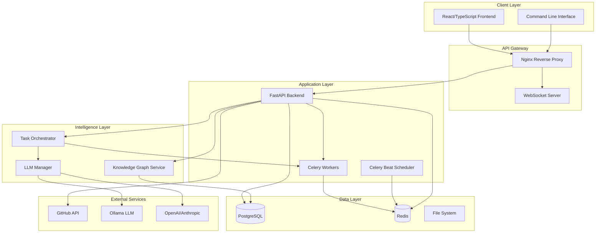

## Core Services Architecture

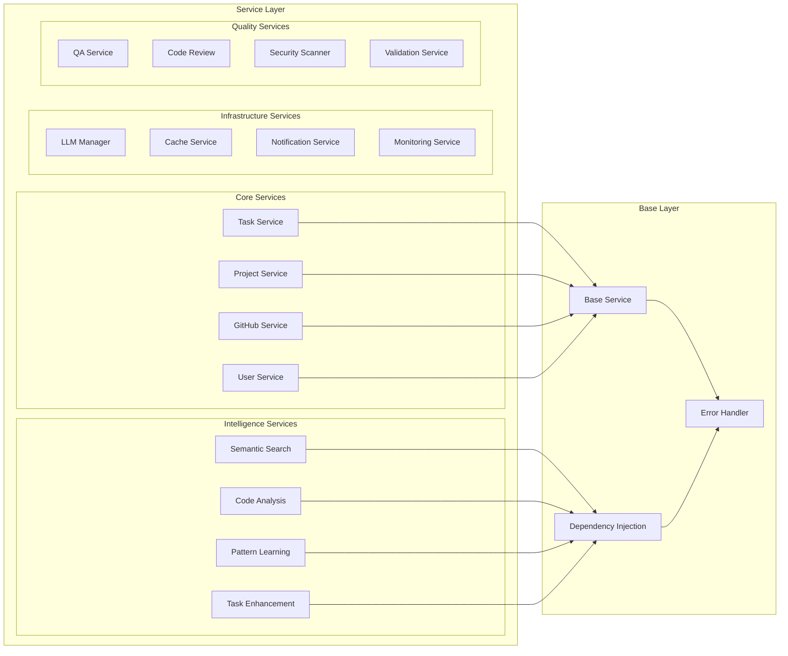

## Task Processing Flow

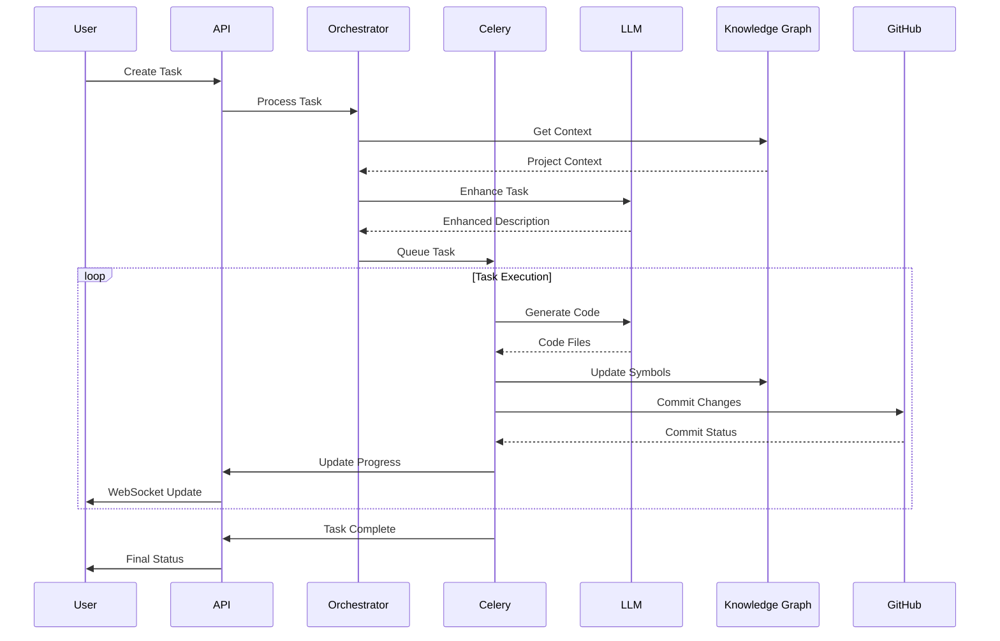

## Knowledge Graph Architecture

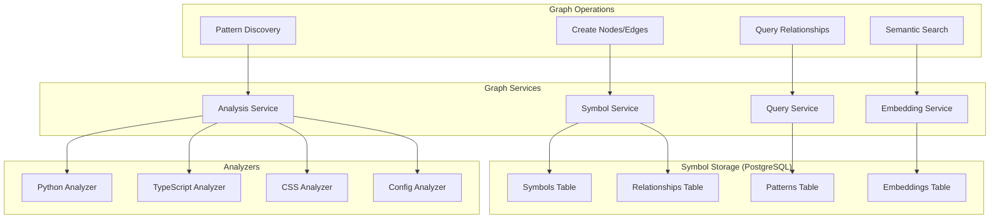

## Deployment Architecture

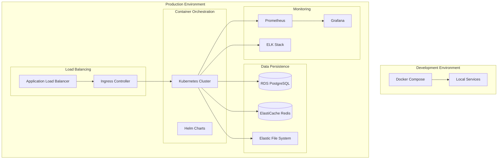

## Real-time Communication Architecture

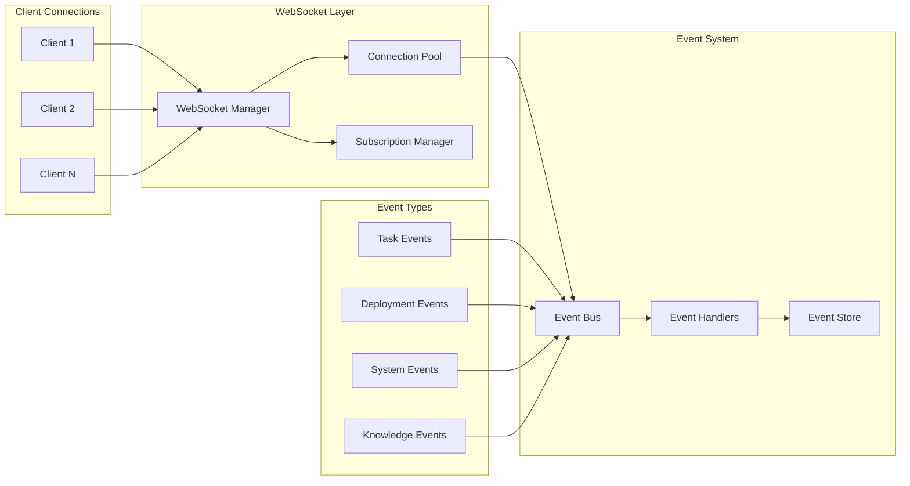

## Security Architecture

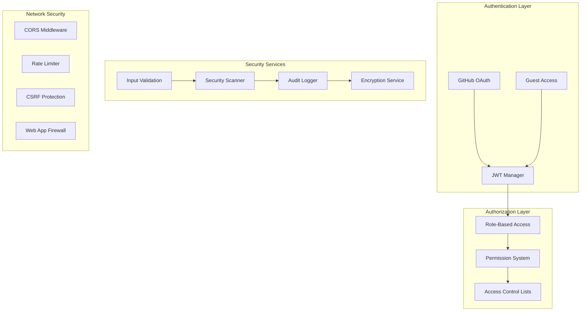

## Data Flow Architecture

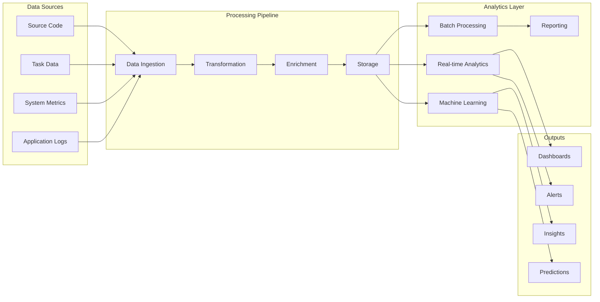

## Scalability Architecture

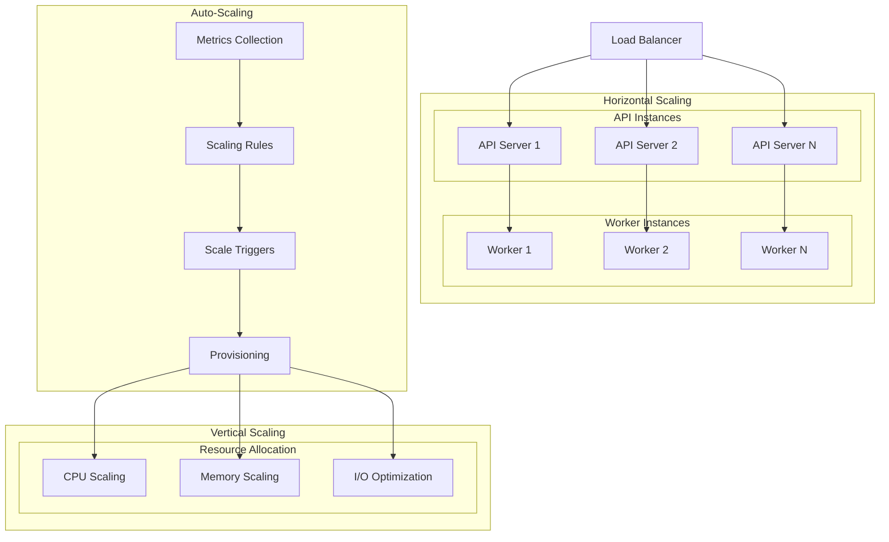

## Development Workflow

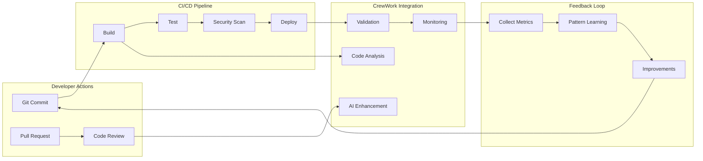

## Component Dependencies

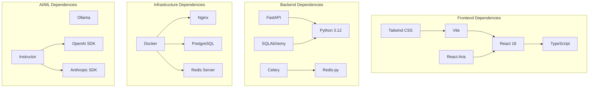

## Error Handling Flow

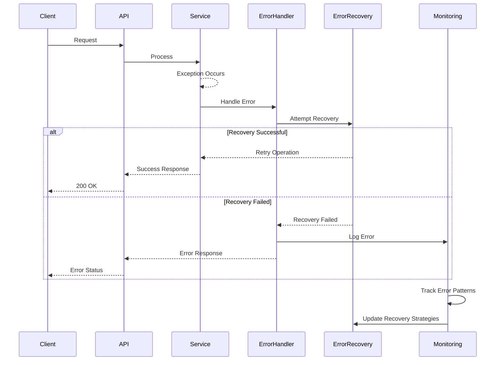

## Performance Optimization Strategy

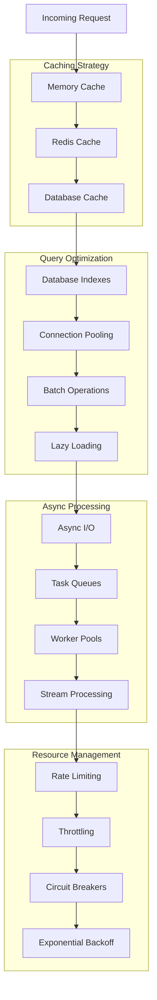

This architecture represents a sophisticated, production-ready system designed for scalability, reliability, and intelligent automation. The microservices architecture allows for independent scaling and deployment, while the knowledge graph provides deep code understanding capabilities that power the AI-driven features.