# CrewWork Architecture Diagrams

## Super High-Level Platform Overview

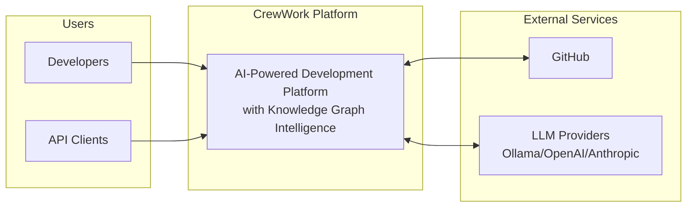

## System Architecture Overview

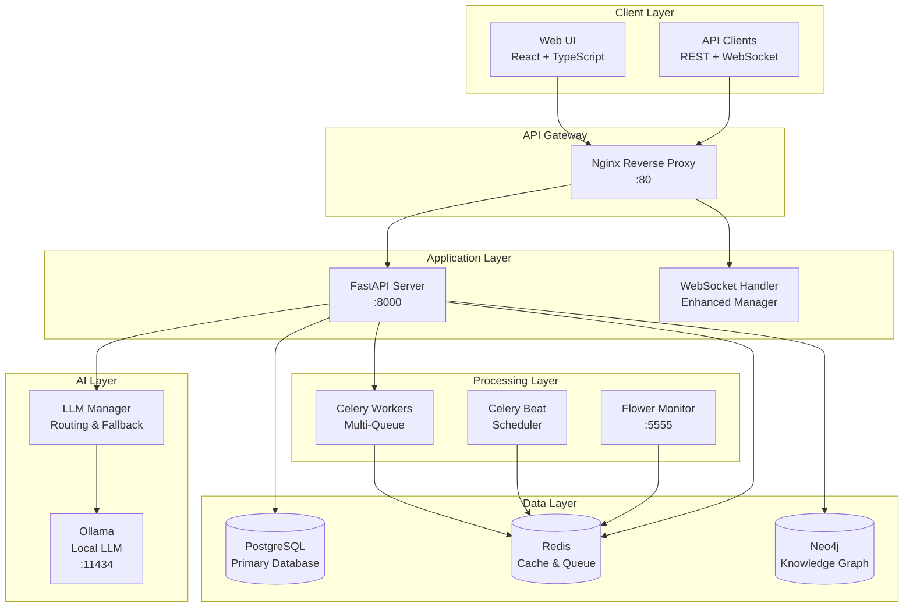

## Detailed Service Architecture

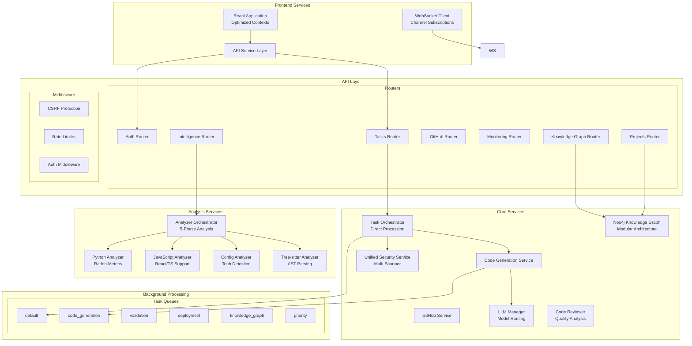

## Task Processing Flow (Celery-Based)

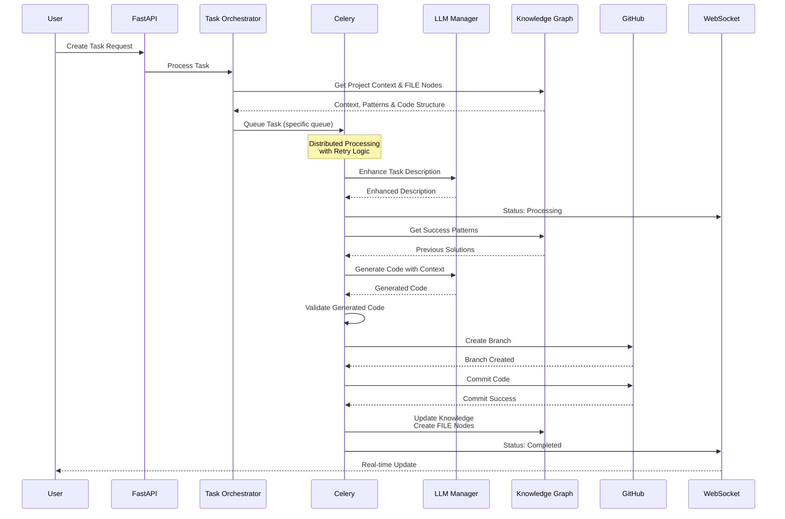

## Knowledge Graph Architecture

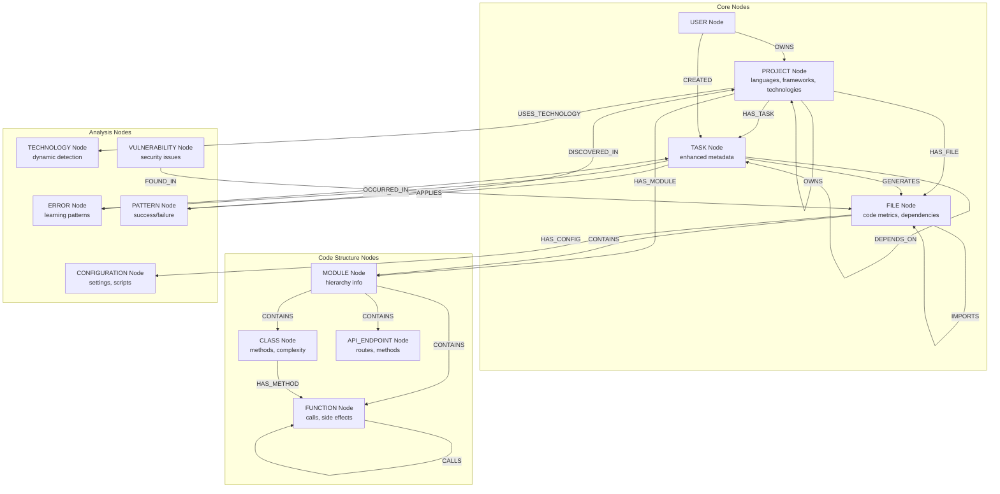

## LLM Integration Architecture

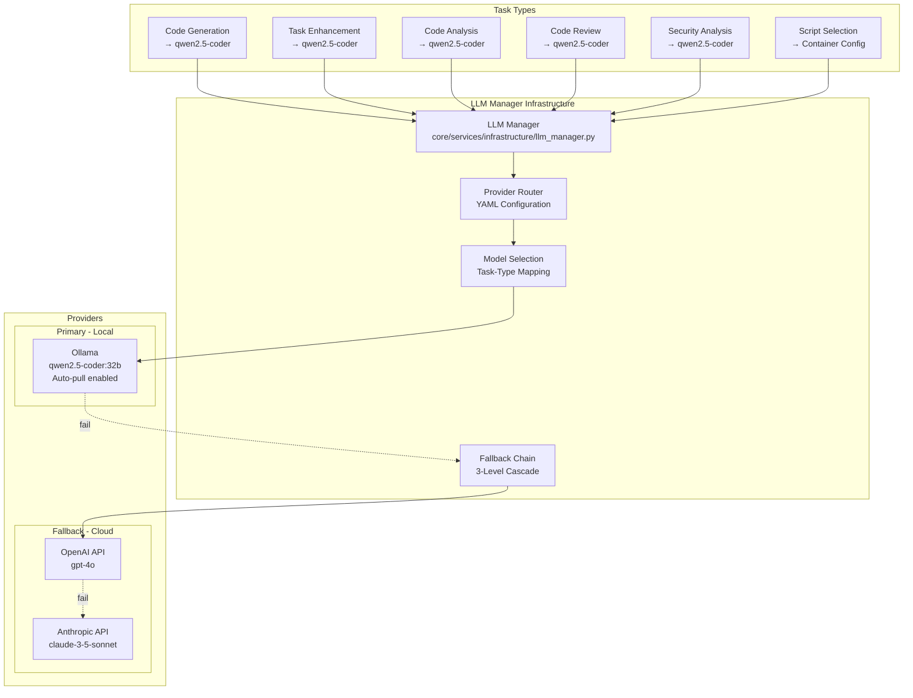

## Security Architecture (Unified Security Service)

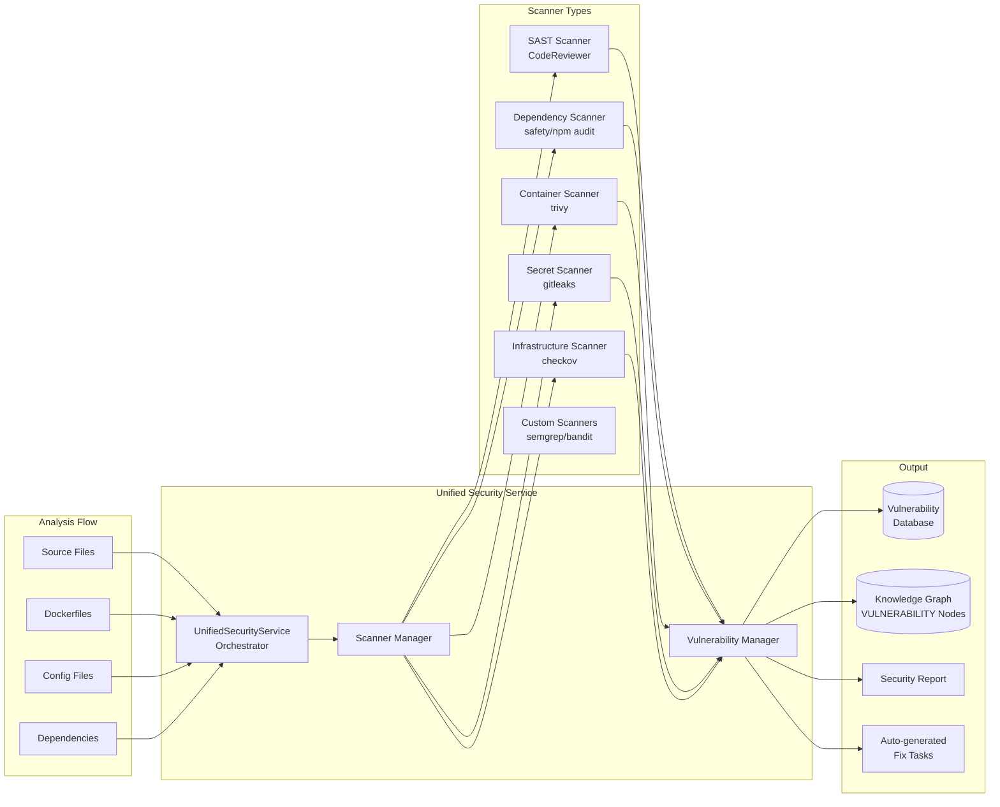

## Codebase Analysis Architecture

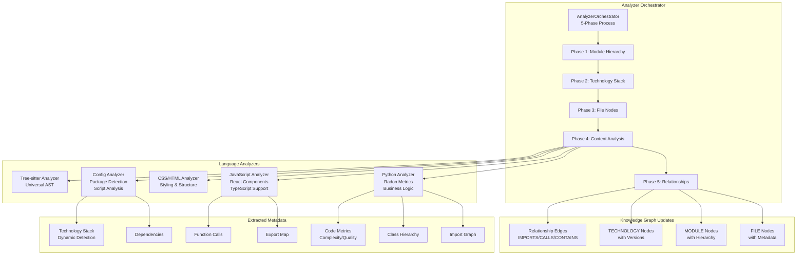

## Container Configuration Intelligence

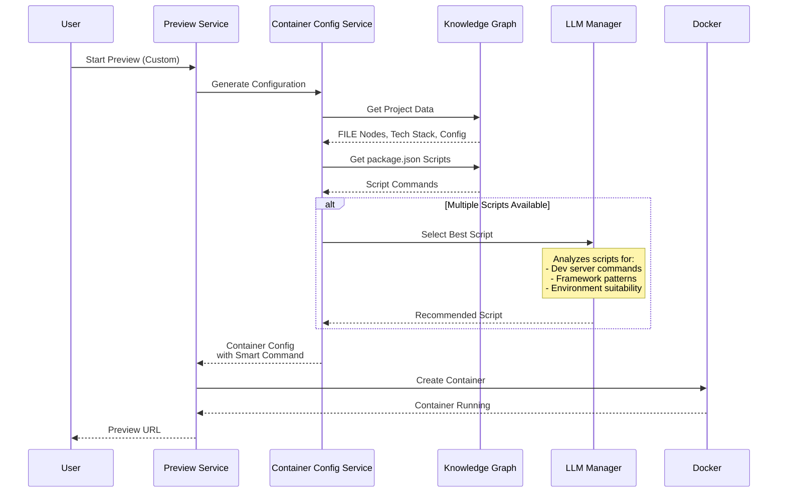

## WebSocket Event Architecture (Enhanced)

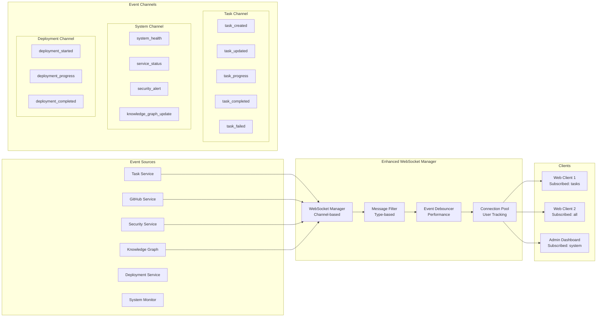

## Performance Architecture

```mermaid
flowchart TB
    subgraph "Frontend Optimizations"
        CONTEXTS[18 Optimized Contexts<br/>useMemoizedContextValue]
        CALLBACKS[Stable Callbacks<br/>useStableCallback]
        REFS[State Refs<br/>No Re-renders]
        DEBOUNCE[WebSocket Debouncing]
    end
    
    subgraph "Backend Optimizations"
        CACHE[Redis Caching<br/>Knowledge Graph Queries]
        BATCH[Batch Operations<br/>Bulk Node/Edge Creation]
        POOL[Connection Pooling<br/>PG & Neo4j]
        INDEXES[Database Indexes<br/>Optimized Queries]
    end
    
    subgraph "Processing Optimizations"
        QUEUES[Multi-Queue Celery<br/>Priority Routing]
        PARALLEL[Parallel Analysis<br/>Concurrent File Processing]
        RETRY[Smart Retry Logic<br/>Exponential Backoff]
    end
    
    CONTEXTS --> CALLBACKS
    CALLBACKS --> REFS
    REFS --> DEBOUNCE
    
    CACHE --> BATCH
    BATCH --> POOL
    POOL --> INDEXES
    
    QUEUES --> PARALLEL
    PARALLEL --> RETRY
```

## Deployment Architecture

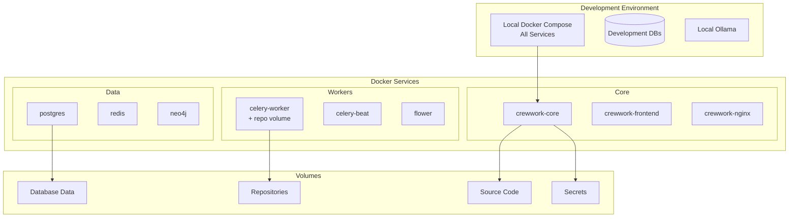