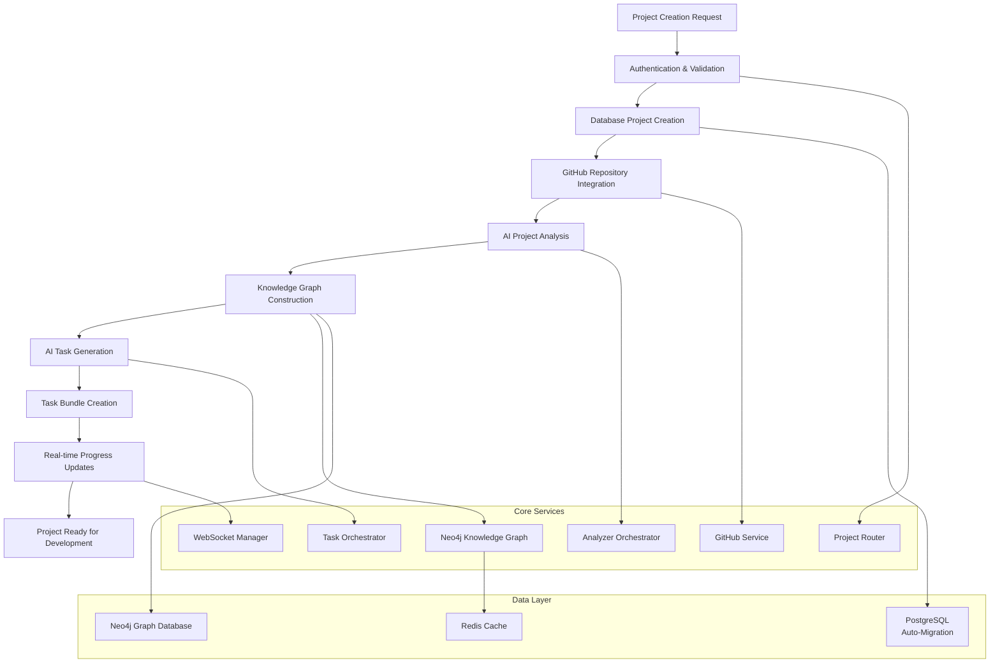
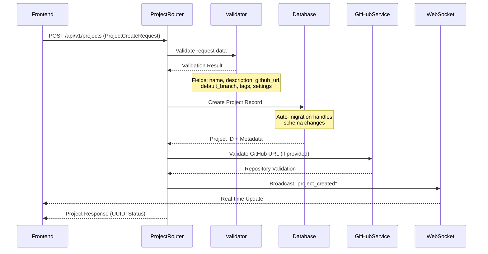
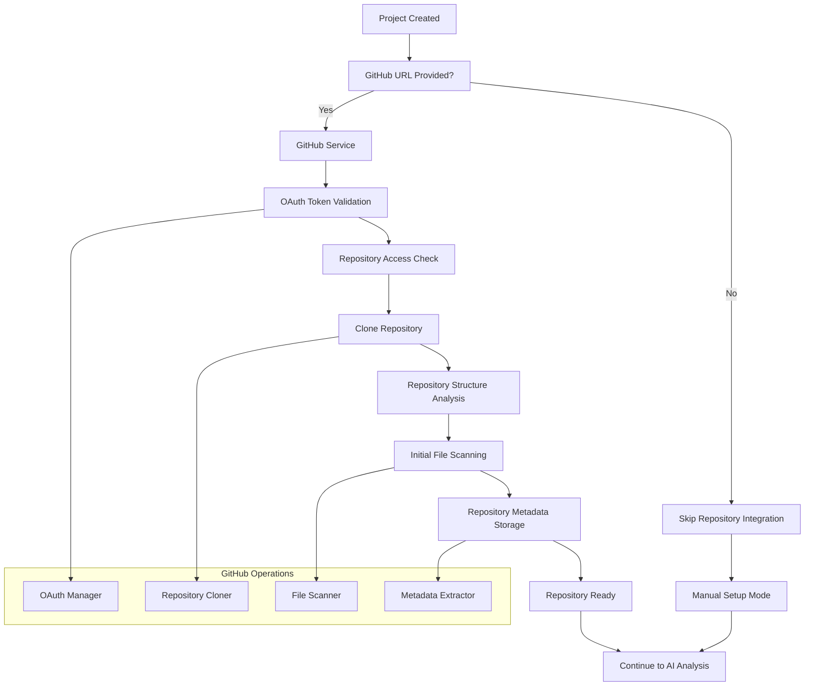
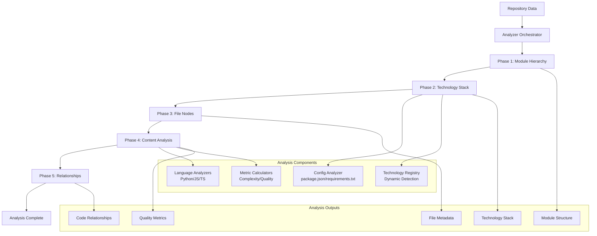
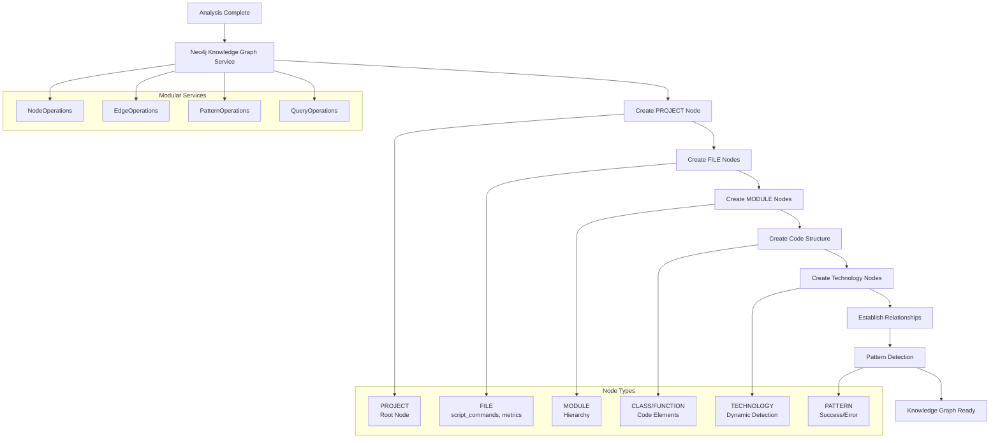
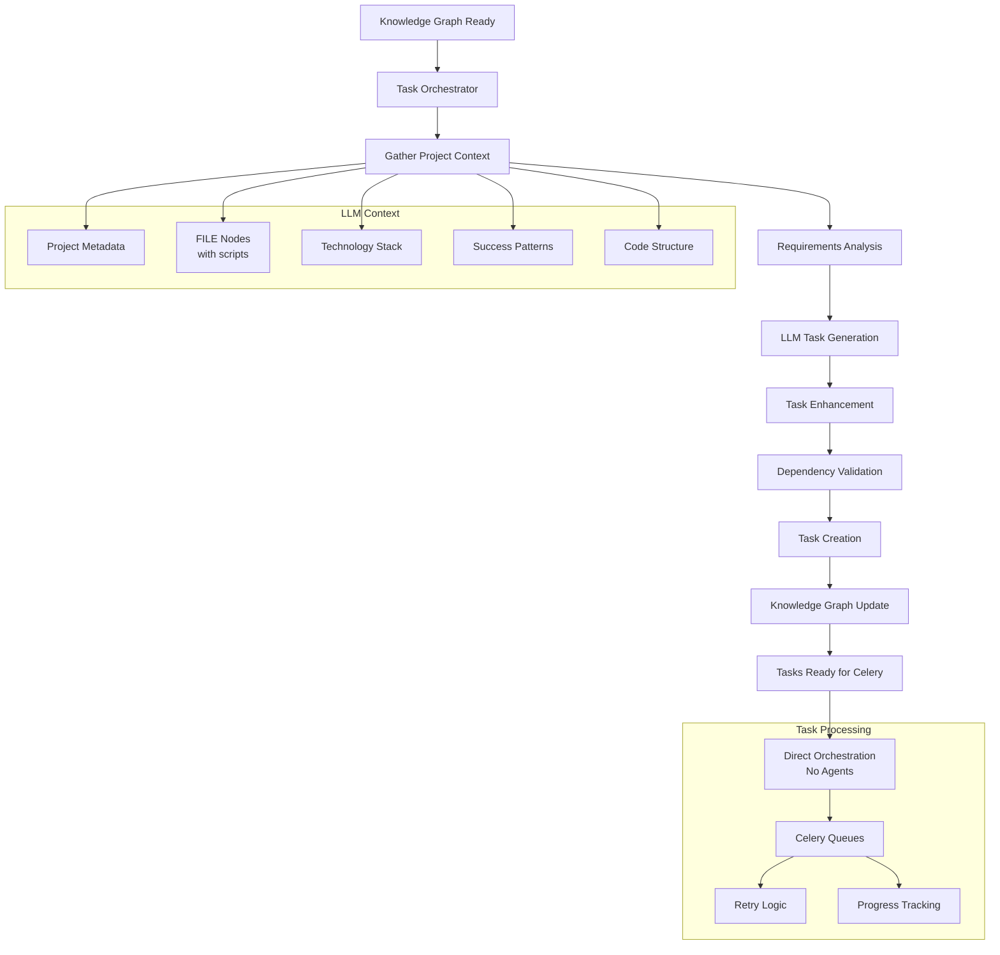
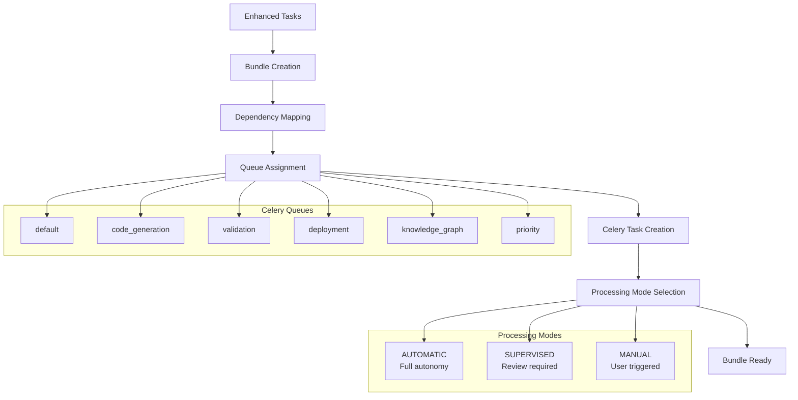
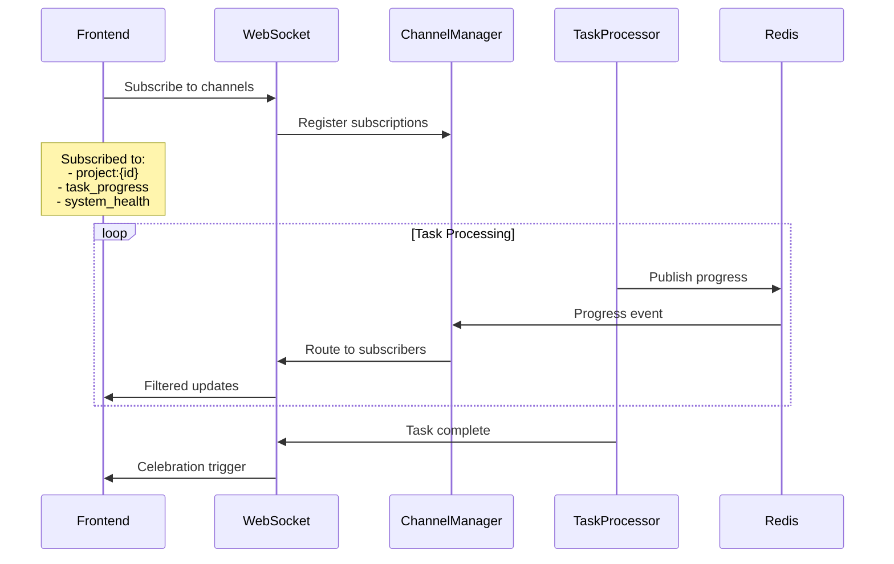

# CrewWork Project Creation & Setup Process

This document provides a comprehensive, phase-based analysis of CrewWork's project creation and initialization system. Built for engineers of all levels with particular focus on architectural and principal engineering concerns, this guide covers the complete workflow from initial project request to autonomous development readiness.

---

## Executive Summary

CrewWork implements a sophisticated project initialization system using **GitHub OAuth integration**, **AI-powered project analysis**, **Neo4j knowledge graph construction**, and **Celery-based task generation**. The system processes project requests through a multi-phase pipeline that combines repository setup, intelligent technology detection, 5-phase codebase analysis, and automated task planning with dependency management.

**Key Technologies:**
- **Backend**: FastAPI with async SQLAlchemy, auto-migration enabled
- **AI Analysis**: Ollama-powered project type detection and task generation
- **Knowledge Graph**: Neo4j with modular service architecture
- **Task Orchestration**: Direct Celery-based processing (no agents)
- **Real-time**: Enhanced WebSocket with channel subscriptions

---

## Overview: Project Creation Architecture



**Core Phases:**
1. **Request Processing** - API validation, authentication, database creation
2. **Repository Integration** - GitHub OAuth, repository cloning and analysis
3. **AI Project Analysis** - Technology stack detection via 5-phase analysis
4. **Knowledge Graph Construction** - Hierarchical semantic graph with FILE nodes
5. **Intelligent Task Generation** - LLM-powered task planning with context
6. **Bundle Management** - Cohesive task grouping for Celery processing
7. **Real-time Coordination** - Progress tracking via enhanced WebSocket

---

## Phase 1: Request Processing & Authentication

Project creation begins with comprehensive validation, authentication, and secure database integration.



### Technical Implementation

**API Endpoint**: `/api/routers/projects.py::create_project()`

**Request Validation**: Uses Pydantic models with comprehensive validation:
- **Name**: 1-100 characters, XSS protection, unique validation
- **Description**: Max 5000 characters with content sanitization
- **GitHub URL**: Optional GitHub repository URL validation
- **Default Branch**: Git branch name pattern matching (default: "main")
- **Tags**: Array validation with max 10 tags
- **Settings**: JSON object for project-specific configuration

**Database Creation**:
```python
# Project Model Creation (db/models.py)
project = Project(
    id=uuid4(),
    name=validated_data.name,
    description=validated_data.description,
    github_url=validated_data.github_url,
    default_branch=validated_data.default_branch or "main",
    tags=validated_data.tags or [],
    settings=validated_data.settings or {},
    status=ProjectStatus.PLANNING,
    user_id=current_user.id,
    created_at=datetime.utcnow()
)
```

**Auto-Migration Feature**:
```python
# No Alembic needed - auto-migration on startup
async def init_database():
    """Initialize database with auto-migration"""
    async with engine.begin() as conn:
        # Automatically create/update all tables
        await conn.run_sync(Base.metadata.create_all)
```

---

## Phase 2: GitHub Repository Integration & Analysis

CrewWork integrates with GitHub repositories using OAuth authentication and comprehensive repository analysis.



### Technical Implementation

**GitHub Service**: `/core/services/github_service.py`

**Repository Integration Process**:
```python
class GitHubService(BaseService):
    async def sync_repository(
        self, 
        project_id: UUID, 
        github_url: str,
        branch: str = "main"
    ) -> dict[str, Any]:
        """Clone and analyze GitHub repository"""
        
        # Parse repository info
        owner, repo = self._parse_github_url(github_url)
        
        # Clone repository to local storage
        repo_path = await self._clone_repository(
            owner=owner,
            repo=repo,
            branch=branch,
            target_path=f"/app/repositories/{project_id}"
        )
        
        # Get repository metadata
        metadata = await self._get_repository_metadata(owner, repo)
        
        # Initial file structure scan
        file_structure = await self._scan_file_structure(repo_path)
        
        # Store in database
        github_repo = GitHubRepository(
            id=uuid4(),
            project_id=project_id,
            owner=owner,
            name=repo,
            full_name=f"{owner}/{repo}",
            default_branch=branch,
            clone_url=github_url,
            last_synced=datetime.utcnow(),
            metadata={
                "stars": metadata.get("stargazers_count", 0),
                "language": metadata.get("language"),
                "size": metadata.get("size"),
                "file_count": len(file_structure)
            }
        )
        
        return {
            "success": True,
            "repository_path": repo_path,
            "file_count": len(file_structure),
            "primary_language": metadata.get("language")
        }
```

**Repository Cloning with Progress**:
```python
async def _clone_repository(
    self, 
    owner: str, 
    repo: str, 
    branch: str,
    target_path: str
) -> str:
    """Clone repository with progress tracking"""
    
    # Use GitPython for cloning
    clone_url = f"https://github.com/{owner}/{repo}.git"
    
    # Clone with progress callback
    def progress_callback(op_code, cur_count, max_count=None, message=''):
        if max_count:
            progress = int((cur_count / max_count) * 100)
            asyncio.create_task(
                self.websocket_manager.broadcast_event(
                    'repository_clone_progress',
                    {
                        'repository': f"{owner}/{repo}",
                        'progress': progress,
                        'message': message
                    }
                )
            )
    
    repo = Repo.clone_from(
        clone_url,
        target_path,
        branch=branch,
        progress=progress_callback
    )
    
    return target_path
```

---

## Phase 3: AI-Powered Project Analysis & Technology Detection

CrewWork employs a sophisticated 5-phase analysis system to understand project structure and detect technologies.



### Technical Implementation

**Analyzer Orchestrator**: `/core/services/code/analyzers/analyzer_orchestrator.py`

**5-Phase Analysis Process**:
```python
class AnalyzerOrchestrator(BaseService):
    async def analyze_repository(
        self, 
        project_id: UUID, 
        repo_path: str
    ) -> AnalysisResult:
        """Execute 5-phase repository analysis"""
        
        logger.info(f"Starting 5-phase analysis for project {project_id}")
        
        # Phase 1: Build Module Hierarchy
        modules = await self._phase1_module_hierarchy(project_id, repo_path)
        logger.info(f"Phase 1 complete: {len(modules)} modules found")
        
        # Phase 2: Analyze Technology Stack
        tech_stack = await self._phase2_technology_stack(project_id, repo_path)
        logger.info(f"Phase 2 complete: {len(tech_stack)} technologies detected")
        
        # Phase 3: Create File Nodes with Metadata
        files = await self._phase3_file_nodes(project_id, repo_path, modules)
        logger.info(f"Phase 3 complete: {len(files)} files processed")
        
        # Phase 4: Deep Content Analysis
        content = await self._phase4_content_analysis(project_id, repo_path, files)
        logger.info(f"Phase 4 complete: Content analysis finished")
        
        # Phase 5: Create Cross-File Relationships
        relationships = await self._phase5_relationships(project_id, content)
        logger.info(f"Phase 5 complete: {len(relationships)} relationships created")
        
        return AnalysisResult(
            modules=modules,
            technologies=tech_stack,
            files=files,
            content_analysis=content,
            relationships=relationships,
            summary=self._generate_analysis_summary(modules, tech_stack, files)
        )
```

**Language-Specific Analysis (Python Example)**:
```python
class PythonAnalyzer(BaseAnalyzer):
    async def analyze_file(
        self, 
        file_path: Path, 
        content: str
    ) -> FileAnalysis:
        """Analyze Python file with Radon metrics"""
        
        # Extract imports using tree-sitter
        imports = await self._extract_imports_tree_sitter(content)
        
        # Calculate complexity metrics with Radon
        complexity = radon.complexity.cc_visit(content)
        maintainability = radon.metrics.mi_visit(content, False)
        
        # Extract code structure
        tree = ast.parse(content)
        classes = self._extract_classes(tree)
        functions = self._extract_functions(tree)
        
        # Extract business logic patterns
        business_logic = await self._extract_business_logic(content)
        
        return FileAnalysis(
            file_path=str(file_path),
            language="python",
            imports=imports,
            exports=functions + [c['name'] for c in classes],
            classes=classes,
            functions=functions,
            metrics={
                'complexity': self._calculate_complexity_score(complexity),
                'maintainability': maintainability,
                'loc': len(content.splitlines()),
                'cyclomatic_complexity': sum(c.complexity for c in complexity)
            },
            business_logic=business_logic
        )
```

**Dynamic Technology Detection**:
```python
class TechnologyRegistry:
    """Dynamic technology detection without hardcoded lists"""
    
    def detect_from_package_json(self, package_data: dict) -> list[Technology]:
        """Detect technologies from package.json"""
        technologies = []
        
        # Detect from dependencies
        deps = {**package_data.get('dependencies', {}), 
                **package_data.get('devDependencies', {})}
        
        for dep_name in deps:
            tech = Technology(
                name=dep_name,
                category=self._categorize_dependency(dep_name),
                version=deps[dep_name],
                confidence=0.9
            )
            technologies.append(tech)
        
        # Detect from scripts
        scripts = package_data.get('scripts', {})
        if 'dev' in scripts or 'start' in scripts:
            # Store script commands in knowledge graph
            script_commands = {k: v for k, v in scripts.items()}
        
        return technologies
    
    def _categorize_dependency(self, name: str) -> str:
        """Categorize technology using patterns"""
        patterns = {
            r'react|vue|angular|svelte': 'framework',
            r'express|fastify|koa': 'backend',
            r'jest|mocha|vitest': 'testing',
            r'webpack|vite|rollup': 'build',
            r'typescript|@types': 'language'
        }
        
        for pattern, category in patterns.items():
            if re.search(pattern, name, re.I):
                return category
        
        return 'library'
```

---

## Phase 4: Knowledge Graph Construction & Hierarchical Organization

CrewWork builds a comprehensive Neo4j knowledge graph with modular service architecture.



### Technical Implementation

**Neo4j Knowledge Graph Service**: `/core/services/data/neo4j_knowledge_graph.py`

**Modular Service Architecture**:
```python
class Neo4jKnowledgeGraphService(BaseService):
    def __init__(self):
        self.driver = GraphDatabase.driver(
            settings.NEO4J_URI,
            auth=(settings.NEO4J_USER, settings.NEO4J_PASSWORD)
        )
        
        # Modular service components
        self.node_ops = NodeOperations(self.driver)
        self.edge_ops = EdgeOperations(self.driver)
        self.pattern_ops = PatternOperations(self.driver)
        self.query_ops = QueryOperations(self.driver)
        
        # Redis cache for performance
        self.cache = RedisCache()
```

**Creating FILE Nodes with Script Commands**:
```python
async def create_file_node(
    self,
    project_id: UUID,
    file_path: str,
    analysis_data: FileAnalysis
) -> str:
    """Create FILE node with comprehensive metadata"""
    
    node_data = {
        'id': str(uuid4()),
        'project_id': str(project_id),
        'path': file_path,
        'name': Path(file_path).name,
        'language': analysis_data.language,
        'size': analysis_data.metrics.get('loc', 0),
        'complexity': analysis_data.metrics.get('complexity', 0),
        'created_at': datetime.utcnow().isoformat()
    }
    
    # Add script commands for package.json
    if file_path.endswith('package.json'):
        node_data['script_commands'] = analysis_data.script_commands
        node_data['has_scripts'] = True
    
    # Create node using NodeOperations
    node_id = await self.node_ops.create_node(
        label='FILE',
        properties=node_data
    )
    
    # Create relationship to project
    await self.edge_ops.create_edge(
        from_id=str(project_id),
        from_label='PROJECT',
        to_id=node_id,
        to_label='FILE',
        relationship_type='HAS_FILE',
        properties={'order': analysis_data.order}
    )
    
    # Clear cache
    await self.cache.delete(f"project_context:{project_id}")
    
    return node_id
```

**Pattern Learning and Storage**:
```python
class PatternOperations:
    async def record_success_pattern(
        self,
        task_id: str,
        pattern_data: dict
    ) -> str:
        """Record successful implementation pattern"""
        
        query = """
        MATCH (t:TASK {id: $task_id})
        MATCH (t)-[:GENERATES]->(f:FILE)
        
        CREATE (p:PATTERN {
            id: $pattern_id,
            name: $name,
            description: $description,
            technology_stack: $tech_stack,
            success_rate: 1.0,
            usage_count: 1,
            created_at: datetime()
        })
        
        CREATE (t)-[:APPLIES]->(p)
        CREATE (p)-[:IMPLEMENTED_IN]->(f)
        
        RETURN p.id as pattern_id
        """
        
        result = await self.execute_write(
            query,
            pattern_id=str(uuid4()),
            task_id=task_id,
            name=pattern_data['name'],
            description=pattern_data['description'],
            tech_stack=pattern_data.get('technology_stack', [])
        )
        
        return result[0]['pattern_id']
```

**Optimized Context Retrieval**:
```python
async def get_project_context(
    self, 
    project_id: UUID
) -> ProjectContext:
    """Get optimized context for LLM with caching"""
    
    # Check cache first
    cache_key = f"project_context:{project_id}"
    cached = await self.cache.get(cache_key)
    if cached:
        return ProjectContext.parse_raw(cached)
    
    # Optimized query with limits
    query = """
    MATCH (p:PROJECT {id: $project_id})
    OPTIONAL MATCH (p)-[:HAS_FILE]->(f:FILE)
    WITH p, COLLECT(f {.path, .language, .script_commands})[..100] as files
    
    OPTIONAL MATCH (p)-[:USES_TECHNOLOGY]->(t:TECHNOLOGY)
    WITH p, files, COLLECT(DISTINCT t {.name, .category}) as technologies
    
    OPTIONAL MATCH (p)-[:APPLIES]->(pattern:PATTERN)
    WHERE pattern.success_rate > 0.7
    WITH p, files, technologies, COLLECT(pattern)[..10] as patterns
    
    RETURN p, files, technologies, patterns
    """
    
    result = await self.query_ops.execute_read(
        query,
        project_id=str(project_id)
    )
    
    # Build context
    context = ProjectContext(
        project=result[0]['p'],
        files=result[0]['files'],
        technologies=result[0]['technologies'],
        patterns=result[0]['patterns']
    )
    
    # Cache for 5 minutes
    await self.cache.set(cache_key, context.json(), ttl=300)
    
    return context
```

---

## Phase 5: Intelligent Task Generation & AI Planning

CrewWork generates comprehensive task plans using LLM analysis with knowledge graph context.



### Technical Implementation

**Task Orchestrator**: `/core/services/task_orchestrator.py`

**Context-Aware Task Generation**:
```python
class TaskOrchestrator(BaseService):
    async def generate_project_tasks(
        self,
        project_id: UUID,
        requirements: str
    ) -> list[Task]:
        """Generate tasks with full knowledge graph context"""
        
        # Get comprehensive project context
        context = await self.knowledge_graph.get_project_context(project_id)
        
        # Build LLM prompt with context
        prompt = self._build_generation_prompt(
            requirements=requirements,
            project_context=context,
            include_patterns=True
        )
        
        # Generate tasks using LLM
        response = await self.llm_manager.process_request(
            prompt=prompt,
            task_type='task_generation',
            temperature=0.7
        )
        
        # Parse generated tasks
        generated_tasks = self._parse_task_response(response)
        
        # Enhance each task with context
        enhanced_tasks = []
        for task_data in generated_tasks:
            enhanced = await self._enhance_task(task_data, context)
            enhanced_tasks.append(enhanced)
        
        # Create tasks in database
        created_tasks = []
        for enhanced_task in enhanced_tasks:
            task = await self._create_task(
                project_id=project_id,
                task_data=enhanced_task,
                auto_process=True  # Ready for Celery
            )
            created_tasks.append(task)
        
        # Update knowledge graph
        await self._update_task_relationships(created_tasks)
        
        return created_tasks
```

**Enhanced Prompt Generation**:
```python
def _build_generation_prompt(
    self,
    requirements: str,
    project_context: ProjectContext,
    include_patterns: bool = True
) -> str:
    """Build comprehensive prompt with knowledge graph context"""
    
    # Extract relevant context
    tech_stack = [t['name'] for t in project_context.technologies]
    file_structure = [f['path'] for f in project_context.files[:20]]
    
    # Find package.json for script commands
    package_json = next(
        (f for f in project_context.files if f['path'].endswith('package.json')),
        None
    )
    available_scripts = []
    if package_json and 'script_commands' in package_json:
        available_scripts = list(package_json['script_commands'].keys())
    
    prompt = f"""
    Generate specific development tasks for this project.
    
    Project Requirements: {requirements}
    
    Project Context:
    - Technology Stack: {', '.join(tech_stack)}
    - Project Type: {project_context.project.get('type', 'unknown')}
    - Key Files: {', '.join(file_structure)}
    - Available NPM Scripts: {', '.join(available_scripts)}
    
    Previous Successful Patterns:
    {self._format_patterns(project_context.patterns) if include_patterns else 'None'}
    
    REQUIREMENTS:
    1. Generate 5-10 specific, actionable tasks
    2. Each task must specify EXACT files to create/modify
    3. Include dependencies between tasks (use array indices)
    4. Consider the available npm scripts when suggesting commands
    5. Follow patterns that have worked well before
    
    Return ONLY a JSON array of tasks with this structure:
    {{
        "title": "Clear task title",
        "description": "Detailed implementation steps",
        "type": "setup|feature|test|docs|fix",
        "tags": ["relevant", "tags"],
        "dependencies": [indices],
        "estimated_complexity": "low|medium|high"
    }}
    """
    
    return prompt
```

**Task Enhancement with Learning**:
```python
async def _enhance_task(
    self,
    task_data: dict,
    context: ProjectContext
) -> dict:
    """Enhance task with additional context and learning"""
    
    # Get similar successful tasks
    similar_patterns = await self.pattern_ops.find_similar_patterns(
        description=task_data['description'],
        tech_stack=context.technologies
    )
    
    # Build enhancement prompt
    enhancement_prompt = f"""
    Enhance this task with specific implementation details:
    
    Task: {task_data['title']}
    Description: {task_data['description']}
    
    Similar Successful Implementations:
    {self._format_patterns(similar_patterns)}
    
    Project Uses: {', '.join(t['name'] for t in context.technologies)}
    
    Provide:
    1. Specific file paths to create/modify
    2. Key functions/classes to implement
    3. Test files to create
    4. Success criteria
    
    Return enhanced description as markdown.
    """
    
    enhanced_response = await self.llm_manager.process_request(
        prompt=enhancement_prompt,
        task_type='task_enhancement',
        temperature=0.3
    )
    
    task_data['enhanced_description'] = enhanced_response.content
    task_data['metadata'] = {
        'enhanced': True,
        'enhancement_date': datetime.utcnow().isoformat(),
        'similar_patterns': [p['id'] for p in similar_patterns],
        'needs_processing': True
    }
    
    return task_data
```

---

## Phase 6: Task Bundle Management & Celery Processing

CrewWork organizes tasks into bundles for coordinated Celery processing.



### Technical Implementation

**Bundle Management**: `/core/services/task_orchestrator.py`

**Task Bundle Creation**:
```python
async def create_task_bundle(
    self,
    project_id: UUID,
    tasks: list[Task],
    bundle_name: str
) -> TaskBundle:
    """Create task bundle for Celery processing"""
    
    # Create bundle
    bundle = TaskBundle(
        id=uuid4(),
        project_id=project_id,
        name=bundle_name,
        description=f"Generated tasks for {bundle_name}",
        task_count=len(tasks),
        bundle_type='cohesive',
        processing_mode='automatic',
        metadata={
            'created_by': 'task_generator',
            'creation_date': datetime.utcnow().isoformat()
        }
    )
    
    # Map task dependencies
    dependency_map = self._build_dependency_map(tasks)
    
    # Assign tasks to Celery queues
    for task in tasks:
        queue = self._determine_queue(task)
        
        # Create Celery task
        celery_result = celery_app.send_task(
            'process_task',
            args=[str(task.id)],
            queue=queue,
            task_id=str(task.id),
            retry=True,
            retry_policy={
                'max_retries': 3,
                'interval_start': 1,
                'interval_step': 2,
                'interval_max': 10
            }
        )
        
        # Update task with Celery ID
        task.celery_task_id = celery_result.id
        task.queue = queue
        task.bundle_id = bundle.id
    
    # Store bundle
    await self.db.add(bundle)
    await self.db.commit()
    
    return bundle
```

**Queue Determination Logic**:
```python
def _determine_queue(self, task: Task) -> str:
    """Determine optimal Celery queue for task"""
    
    # Check task type and content
    description_lower = task.description.lower()
    
    if any(keyword in description_lower for keyword in ['generate', 'create', 'implement']):
        return 'code_generation'
    elif any(keyword in description_lower for keyword in ['test', 'validate', 'check']):
        return 'validation'
    elif any(keyword in description_lower for keyword in ['deploy', 'build', 'package']):
        return 'deployment'
    elif any(keyword in description_lower for keyword in ['analyze', 'scan', 'review']):
        return 'knowledge_graph'
    elif task.priority == 'high':
        return 'priority'
    else:
        return 'default'
```

**Celery Task Processing**:
```python
@celery_app.task(
    name='process_task',
    bind=True,
    base=Task,
    acks_late=True
)
def process_task(self, task_id: str):
    """Process task with retry logic and learning"""
    
    try:
        # Run async task processing
        result = asyncio.run(
            task_processor.process_task(UUID(task_id))
        )
        
        # Record success pattern
        asyncio.run(
            pattern_ops.record_success_pattern(
                task_id=task_id,
                pattern_data={
                    'name': f"Success: {result.task_type}",
                    'description': result.approach,
                    'technology_stack': result.technologies_used
                }
            )
        )
        
        return result.dict()
        
    except Exception as e:
        # Record error for learning
        asyncio.run(
            knowledge_graph.record_error(
                task_id=task_id,
                error_data={
                    'type': type(e).__name__,
                    'message': str(e),
                    'stack_trace': traceback.format_exc()
                }
            )
        )
        
        # Retry with enhanced context
        raise self.retry(exc=e)
```

---

## Phase 7: Real-time Progress Tracking & WebSocket Coordination

Enhanced WebSocket system with channel subscriptions for granular progress tracking.



### Technical Implementation

**Enhanced WebSocket Manager**: `/api/websocket_manager.py`

**Channel-Based Broadcasting**:
```python
class EnhancedWebSocketManager:
    def __init__(self):
        self.connections: dict[str, dict[str, WebSocket]] = {}
        self.subscriptions: dict[str, set[str]] = defaultdict(set)
        self.channel_manager = ChannelManager()
        
    async def subscribe_to_channels(
        self,
        user_id: str,
        channels: list[str]
    ):
        """Subscribe user to specific channels"""
        for channel in channels:
            self.subscriptions[channel].add(user_id)
            logger.info(f"User {user_id} subscribed to {channel}")
    
    async def broadcast_to_channel(
        self,
        channel: str,
        event: dict,
        debounce: bool = True
    ):
        """Broadcast to channel subscribers with debouncing"""
        
        # Add channel info
        event['channel'] = channel
        event['timestamp'] = datetime.utcnow().isoformat()
        
        # Debounce high-frequency events
        if debounce and self._should_debounce(event['type']):
            await self._debounced_send(channel, event)
        else:
            await self._send_to_channel(channel, event)
    
    async def _send_to_channel(self, channel: str, event: dict):
        """Send event to all channel subscribers"""
        subscribers = self.subscriptions.get(channel, set())
        
        for user_id in subscribers:
            if user_id in self.connections:
                for conn_id, websocket in self.connections[user_id].items():
                    try:
                        await websocket.send_json(event)
                    except Exception as e:
                        logger.error(f"Failed to send to {user_id}: {e}")
```

**Project Progress Broadcasting**:
```python
async def broadcast_project_progress(
    self,
    project_id: UUID,
    phase: str,
    progress_data: dict
):
    """Broadcast project creation progress"""
    
    # Calculate overall progress
    phase_weights = {
        'repository_sync': 15,
        'analysis': 25,
        'knowledge_graph': 20,
        'task_generation': 25,
        'finalization': 15
    }
    
    completed_weight = sum(
        phase_weights[p] 
        for p in progress_data.get('completed_phases', [])
    )
    total_weight = sum(phase_weights.values())
    overall_progress = int((completed_weight / total_weight) * 100)
    
    event = {
        'type': 'project_progress',
        'project_id': str(project_id),
        'phase': phase,
        'overall_progress': overall_progress,
        'phase_progress': progress_data.get('phase_progress', 0),
        'message': progress_data.get('message', ''),
        'details': progress_data
    }
    
    # Broadcast to project channel
    await self.broadcast_to_channel(
        f"project:{project_id}",
        event
    )
```

**Task Progress with Container Intelligence**:
```python
async def broadcast_task_progress(
    self,
    task_id: UUID,
    status: str,
    progress_data: dict
):
    """Broadcast task execution progress"""
    
    event = {
        'type': 'task_progress',
        'task_id': str(task_id),
        'status': status,
        'progress': progress_data.get('progress', 0),
        'current_step': progress_data.get('current_step', ''),
        'total_steps': progress_data.get('total_steps', 0),
        'message': progress_data.get('message', ''),
        'generated_files': progress_data.get('generated_files', [])
    }
    
    # Special handling for container preview
    if status == 'preview_ready':
        # Get start command from knowledge graph
        script_info = await self._get_preview_script(task_id)
        event['preview_command'] = script_info.get('command', 'npm start')
        event['preview_url'] = progress_data.get('preview_url')
    
    await self.broadcast_to_channel(
        f"task:{task_id}",
        event,
        debounce=True  # Prevent spam
    )
```

---

## Frontend Integration & User Experience

CrewWork provides comprehensive React 19 integration with optimized contexts.

### React Components

**Project Creation Hook**: `/frontend/src/hooks/useProjectCreation.ts`
```typescript
export function useProjectCreation() {
  const queryClient = useQueryClient();
  const { subscribe } = useWebSocketSubscription();
  const [progress, setProgress] = useState<ProjectProgress | null>(null);
  
  const createProject = useMutation({
    mutationFn: async (data: ProjectCreateRequest) => {
      return api.post<Project>(getApiUrl('/projects'), data);
    },
    onSuccess: (project) => {
      // Subscribe to project progress
      const channels = [
        `project:${project.id}`,
        'project_progress',
        'task_generation'
      ];
      
      subscribe(channels, (event) => {
        if (event.project_id === project.id) {
          setProgress(event);
        }
      });
      
      // Invalidate queries
      void queryClient.invalidateQueries({ queryKey: ['projects'] });
    }
  });
  
  return {
    createProject: createProject.mutate,
    isCreating: createProject.isPending,
    progress,
    error: createProject.error
  };
}
```

**Progress Dashboard**: `/frontend/src/components/projects/ProjectProgressDashboard.tsx`
```typescript
export function ProjectProgressDashboard({ projectId }: Props) {
  const { progress } = useProjectProgress(projectId);
  
  if (!progress) return <LoadingSpinner />;
  
  const phases = [
    { id: 'repository_sync', label: 'Repository Sync', icon: GitHubIcon },
    { id: 'analysis', label: '5-Phase Analysis', icon: AnalysisIcon },
    { id: 'knowledge_graph', label: 'Knowledge Graph', icon: GraphIcon },
    { id: 'task_generation', label: 'Task Generation', icon: TaskIcon },
    { id: 'finalization', label: 'Finalization', icon: CheckIcon }
  ];
  
  return (
    <div className="space-y-6">
      <ProgressBar value={progress.overall_progress} />
      
      <div className="grid gap-4">
        {phases.map((phase) => (
          <PhaseCard
            key={phase.id}
            phase={phase}
            status={progress.phases[phase.id]}
            isActive={progress.phase === phase.id}
          />
        ))}
      </div>
      
      {progress.phase === 'finalization' && (
        <TaskCompletionCelebration
          message="Project creation complete!"
          taskCount={progress.details.task_count}
        />
      )}
    </div>
  );
}
```

---

## Architecture Considerations

### Performance Optimizations

**Caching Strategy**:
- Redis caching for knowledge graph queries (5-minute TTL)
- LLM response caching for repeated patterns
- Project context caching with automatic invalidation

**Parallel Processing**:
- 5-phase analysis runs language analyzers in parallel
- Celery workers scale horizontally across queues
- Batch operations for Neo4j node/edge creation

**Database Optimization**:
- Auto-migration eliminates Alembic overhead
- Connection pooling with asyncpg
- Optimized Cypher queries with limits

### Security Considerations

**GitHub Integration**:
- OAuth token encryption at rest
- Repository access validation
- Secure cloning with progress tracking

**LLM Security**:
- Prompt injection prevention
- Output sanitization
- Context size limits

**Knowledge Graph**:
- Query result limits to prevent DoS
- Access control per project
- Audit logging for modifications

### Monitoring & Observability

**Structured Logging**:
```python
logger.info(
    "Project creation completed",
    extra={
        'project_id': str(project_id),
        'duration_seconds': duration,
        'task_count': len(tasks),
        'technologies': tech_stack,
        'success': True
    }
)
```

**Metrics Collection**:
- Project creation duration
- Task generation accuracy
- Knowledge graph query performance
- LLM response times

**Error Tracking**:
- Comprehensive error context
- Pattern learning from failures
- Automatic retry with enhanced context

---

## Container Intelligence Integration

**Smart Preview Configuration**:
When creating preview containers, CrewWork uses knowledge graph data to intelligently detect the correct start command:

```python
async def get_preview_configuration(
    self, 
    project_id: UUID
) -> ContainerConfig:
    """Get intelligent container configuration"""
    
    # Query knowledge graph for package.json scripts
    context = await self.knowledge_graph.get_project_context(project_id)
    
    # Find package.json FILE node
    package_json = next(
        (f for f in context.files if f['path'].endswith('package.json')),
        None
    )
    
    if package_json and 'script_commands' in package_json:
        # Use LLM to select best script
        best_script = await self.llm_manager.process_request(
            prompt=f"""
            Select the best npm script for development preview:
            Available scripts: {json.dumps(package_json['script_commands'])}
            Prefer: dev, develop, start, serve
            Return only the script name.
            """,
            task_type='script_selection'
        )
        
        return ContainerConfig(
            command=f"npm run {best_script.content.strip()}"
        )
```

This eliminates the common "npm start" error by using actual available scripts from the project.

---

## Summary

CrewWork's project creation system represents a sophisticated integration of:
- **Direct task orchestration** without complex agent systems
- **5-phase codebase analysis** with language-specific analyzers
- **Modular Neo4j services** for knowledge graph operations
- **Intelligent LLM routing** with Ollama as primary provider
- **Enhanced WebSocket** with channel-based subscriptions
- **Container intelligence** using knowledge graph data

The system processes projects from initial request through to autonomous development readiness, with comprehensive progress tracking and error handling throughout.