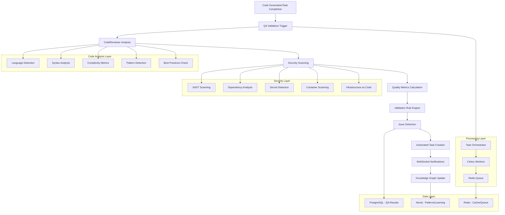
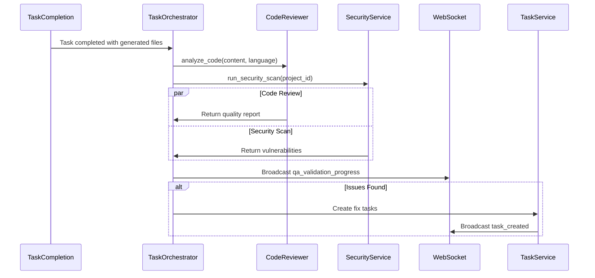
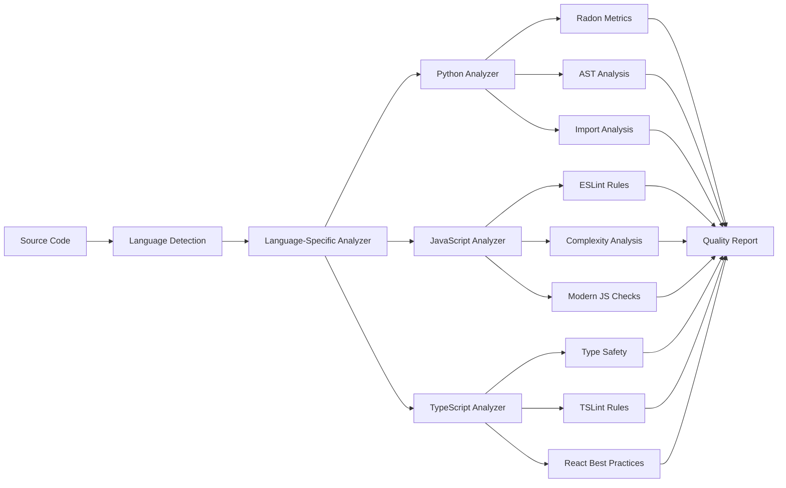
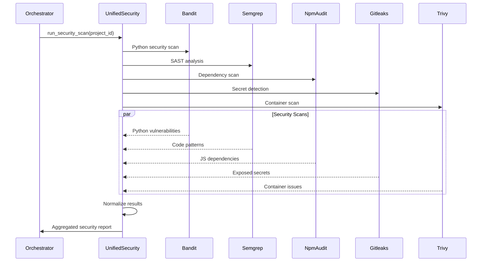
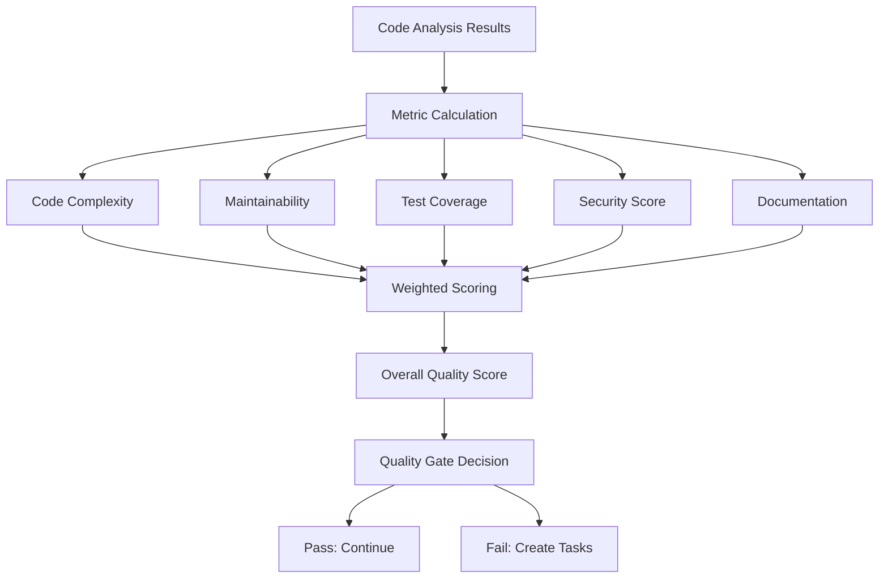
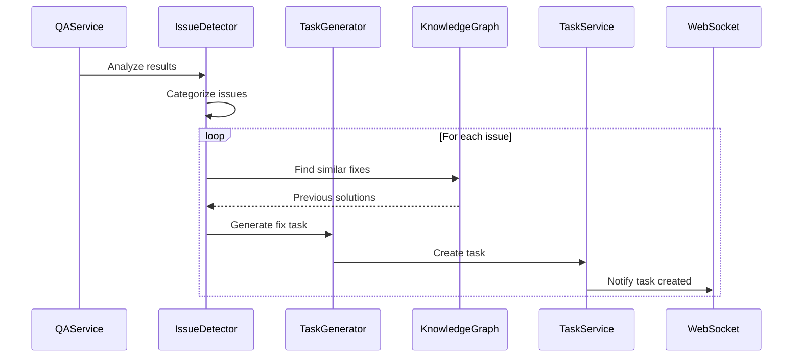
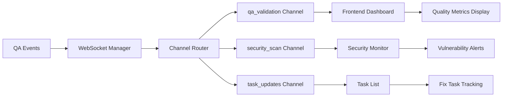
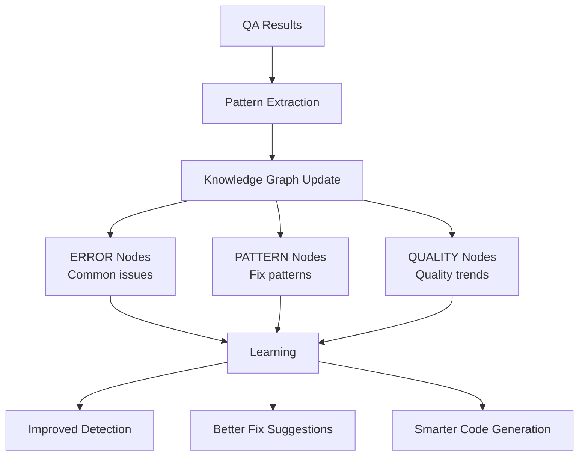

# CrewWork QA Validation & Code Review Process

This document provides a comprehensive analysis of CrewWork's QA validation and automated code review system. Built for engineers of all levels with particular focus on architectural and principal engineering concerns, this guide covers the complete workflow from automated code analysis to security scanning and quality enforcement.

---

## Executive Summary

CrewWork implements a sophisticated QA validation system using the **CodeReviewer service**, **UnifiedSecurityService**, **real-time monitoring**, and **automated task creation for issues**. The system automatically analyzes code quality, performs security scanning, validates generated files, and provides continuous feedback through WebSocket notifications.

**Key Technologies:**
- **Code Review**: CodeReviewer with language-specific analyzers (Python, JavaScript, TypeScript)
- **Security**: UnifiedSecurityService integrating multiple scanners (Bandit, Semgrep, npm audit, etc.)
- **Quality Metrics**: Radon for Python complexity, custom analyzers for other languages
- **Real-time**: WebSocket-based progress notifications
- **Processing**: Celery task queue for asynchronous validation

---

## Overview: QA Validation Architecture



**Core Phases:**
1. **Trigger Points** - Automatic validation after code generation/changes
2. **Code Review** - Language-specific analysis with CodeReviewer
3. **Security Scanning** - Comprehensive vulnerability detection
4. **Quality Metrics** - Complexity and maintainability scoring
5. **Issue Detection** - Identification of code quality issues
6. **Task Generation** - Automatic creation of fix tasks
7. **Real-time Updates** - WebSocket progress notifications

---

## Phase 1: QA Validation Triggers

QA validation is automatically triggered at key points in the development lifecycle.



### Trigger Points

**Automatic Triggers:**
1. **Task Completion** - After code generation tasks complete
2. **File Generation** - When new files are created
3. **Pull Request** - Before merging changes
4. **Scheduled Scans** - Periodic quality checks via Celery Beat

**Manual Triggers:**
- API endpoint: `POST /api/v1/qa/review/{project_id}`
- UI button in project QA dashboard
- CLI command for local development

### Implementation

**Task Orchestrator Integration**: `/core/services/task_orchestrator.py`

```python
async def process_task(self, task_id: UUID) -> TaskResult:
    """Process task with integrated QA validation"""
    
    # Generate code
    generated_files = await self._generate_code(task, context)
    
    # Run code review
    for file_data in generated_files:
        review_result = await self.code_reviewer.analyze_code(
            code=file_data['content'],
            language=file_data['language'],
            context={'file_path': file_data['path']}
        )
        
        if review_result['issues']:
            await self._create_fix_tasks(review_result['issues'])
    
    # Run security scan
    security_results = await self.security_service.run_security_scan(
        project_id=task.project_id
    )
    
    # Broadcast progress
    await self.websocket_manager.broadcast_event(
        'qa_validation_completed',
        {'task_id': str(task_id), 'results': review_result}
    )
```

---

## Phase 2: Code Review with CodeReviewer

The CodeReviewer service performs comprehensive static analysis.



### CodeReviewer Implementation

**Service**: `/core/qa/code_reviewer.py`

**Key Features:**
- **Multi-language Support**: Python, JavaScript, TypeScript, and more
- **Complexity Metrics**: Cyclomatic complexity, maintainability index
- **Pattern Detection**: Common anti-patterns and code smells
- **Best Practices**: Language-specific best practice validation
- **Auto-fix Suggestions**: Automated fix recommendations

### Language-Specific Analysis

**Python Analysis**:
```python
class CodeReviewer:
    def analyze_code(self, code: str, language: str = "python", context: dict = None) -> dict[str, Any]:
        """Analyze code and return quality report"""
        
        # Basic quality checks
        issues = []
        suggestions = []
        quality_score = 5.0
        
        # Language-specific analysis
        if language == "python":
            # Radon complexity analysis
            complexity = radon.complexity.cc_visit(code)
            maintainability = radon.metrics.mi_visit(code, False)
            
            # Check for issues
            for i, line in enumerate(code.split('\n'), 1):
                # Long lines
                if len(line) > 120:
                    issues.append({
                        'line_number': i,
                        'severity': 'warning',
                        'message': f'Line too long ({len(line)} > 120 characters)',
                        'suggestion': 'Consider breaking this line'
                    })
                    quality_score -= 0.1
                
                # Bare except
                if line.strip() == "except:":
                    issues.append({
                        'line_number': i,
                        'severity': 'error',
                        'message': 'Bare except clause',
                        'suggestion': 'Specify exception type'
                    })
                    quality_score -= 0.5
```

**JavaScript/TypeScript Analysis**:
- ESLint rule integration
- React-specific checks
- TypeScript type safety validation
- Modern JavaScript feature usage

### Quality Metrics

**Metrics Calculated**:
1. **Complexity Score**: Based on cyclomatic complexity
2. **Maintainability Index**: Code maintainability rating
3. **Test Coverage**: Integration with coverage reports
4. **Documentation**: Docstring/comment coverage
5. **Code Duplication**: Detection of repeated patterns

---

## Phase 3: Security Scanning with UnifiedSecurityService

Comprehensive security analysis across multiple dimensions.



### UnifiedSecurityService Implementation

**Service**: `/core/services/unified_security_service.py`

```python
class UnifiedSecurityService(BaseService):
    def __init__(self):
        self.scanners = {
            'sast': CodeReviewer(),
            'dependency': DependencyScanner(),
            'container': ContainerScanner(),
            'secrets': SecretScanner(),
            'infrastructure': InfrastructureScanner()
        }
    
    async def run_security_scan(self, project_id: UUID) -> SecurityReport:
        """Run comprehensive security scan"""
        
        # Get repository path
        repo_path = f"/app/repositories/{project_id}"
        
        # Run all scanners in parallel
        scan_tasks = []
        for name, scanner in self.scanners.items():
            task = self._run_scanner(name, scanner, project_id, repo_path)
            scan_tasks.append(task)
        
        results = await asyncio.gather(*scan_tasks, return_exceptions=True)
        
        # Normalize and aggregate results
        vulnerabilities = self._normalize_vulnerabilities(results)
        
        # Create fix tasks for critical issues
        if vulnerabilities:
            await self._create_automated_fix_tasks(vulnerabilities)
        
        # Update knowledge graph
        await self._update_security_knowledge(project_id, vulnerabilities)
        
        return SecurityReport(
            project_id=project_id,
            vulnerabilities=vulnerabilities,
            scan_date=datetime.utcnow(),
            summary=self._generate_summary(vulnerabilities)
        )
```

### Security Scanner Integration

**Supported Scanners**:
- **Bandit**: Python security linter
- **Semgrep**: Multi-language SAST
- **npm audit**: Node.js dependency scanner
- **Safety**: Python dependency checker
- **Gitleaks**: Secret detection
- **Trivy**: Container vulnerability scanner
- **Checkov**: Infrastructure as Code scanner

---

## Phase 4: Quality Metrics and Scoring

Comprehensive quality scoring based on multiple factors.



### Quality Metrics Implementation

**Metrics Model**: `/core/models/qa.py`

```python
class QualityReport:
    def __init__(self):
        self.complexity_score = 0.0
        self.maintainability_score = 0.0
        self.test_coverage = 0.0
        self.security_score = 0.0
        self.documentation_score = 0.0
    
    def calculate_overall_score(self) -> float:
        """Calculate weighted overall quality score"""
        weights = {
            'complexity': 0.25,
            'maintainability': 0.25,
            'test_coverage': 0.20,
            'security': 0.20,
            'documentation': 0.10
        }
        
        score = (
            self.complexity_score * weights['complexity'] +
            self.maintainability_score * weights['maintainability'] +
            self.test_coverage * weights['test_coverage'] +
            self.security_score * weights['security'] +
            self.documentation_score * weights['documentation']
        )
        
        return min(100, max(0, score))
```

### Quality Gates

**Configurable Thresholds**:
- **Minimum Quality Score**: 70/100
- **Maximum Complexity**: 10 per function
- **Minimum Test Coverage**: 80%
- **Zero Critical Security Issues**
- **Documentation Coverage**: 60%

---

## Phase 5: Automated Issue Resolution

CrewWork automatically creates tasks to fix detected issues.



### Task Generation Logic

```python
async def _create_fix_tasks(self, issues: list[dict]) -> list[Task]:
    """Create tasks to fix detected issues"""
    
    tasks = []
    for issue in issues:
        # Get fix patterns from knowledge graph
        similar_fixes = await self.knowledge_graph.find_similar_fixes(
            issue_type=issue['type'],
            language=issue['language']
        )
        
        # Generate task description with context
        task_description = self._generate_fix_description(
            issue=issue,
            similar_fixes=similar_fixes
        )
        
        # Create task
        task = await self.task_service.create_task(
            title=f"Fix {issue['severity']} issue: {issue['message']}",
            description=task_description,
            project_id=self.project_id,
            priority='high' if issue['severity'] == 'error' else 'medium',
            tags=['qa', 'auto-generated', issue['type']],
            metadata={
                'issue_details': issue,
                'suggested_fixes': similar_fixes,
                'auto_process': False  # Require review
            }
        )
        
        tasks.append(task)
    
    return tasks
```

---

## Phase 6: Real-time Progress and Notifications

WebSocket-based real-time updates throughout the QA process.



### WebSocket Events

**QA-Specific Events**:
```typescript
interface QAWebSocketEvent {
  type: 'qa_started' | 'qa_progress' | 'qa_completed' | 'qa_failed';
  channel: 'qa_validation';
  data: {
    project_id: string;
    task_id?: string;
    stage: 'code_review' | 'security_scan' | 'metrics';
    progress: number;
    results?: {
      quality_score: number;
      issues_found: number;
      vulnerabilities: number;
      tasks_created: number;
    };
    error?: string;
  };
}
```

### Frontend Integration

**React Components**: `/frontend/src/components/quality/`
- `QualityAssuranceDashboard.tsx` - Main QA dashboard
- `CodeReviewResults.tsx` - Code review findings
- `SecurityScanResults.tsx` - Security vulnerabilities
- `QualityMetrics.tsx` - Quality score visualization

---

## Knowledge Graph Integration

QA results contribute to continuous learning and improvement.



### Pattern Learning

```python
async def _update_quality_patterns(self, qa_results: dict):
    """Update knowledge graph with quality patterns"""
    
    # Record error patterns
    for issue in qa_results['issues']:
        await self.pattern_ops.record_error_pattern(
            pattern_data={
                'type': issue['type'],
                'language': issue['language'],
                'context': issue['context'],
                'frequency': 1
            }
        )
    
    # Record successful fixes
    if qa_results['fixes_applied']:
        for fix in qa_results['fixes_applied']:
            await self.pattern_ops.record_success_pattern(
                pattern_data={
                    'issue_type': fix['issue_type'],
                    'fix_approach': fix['approach'],
                    'effectiveness': fix['success_rate']
                }
            )
```

---

## Performance Optimizations

### Parallel Processing
- Language analyzers run concurrently
- Security scanners execute in parallel
- Celery workers handle multiple QA jobs

### Caching Strategy
- Analysis results cached in Redis (5-minute TTL)
- Common patterns cached for quick lookup
- Security scan results cached per commit

### Resource Management
- File analysis batched for memory efficiency
- Large files processed in chunks
- Timeout limits for runaway analyses

---

## Security Considerations

### Sandboxed Execution
- Code analysis in isolated environments
- Resource limits on analysis processes
- No execution of analyzed code

### Vulnerability Handling
- Sensitive data redacted from reports
- Secure storage of vulnerability details
- Access control on security findings

### Audit Trail
- All QA activities logged
- Issue detection tracked
- Fix task creation audited

---

## Monitoring and Metrics

### QA Dashboard Metrics
- Average quality score trends
- Common issue types
- Fix task completion rates
- Security vulnerability trends

### Performance Metrics
- Analysis duration per language
- Scanner execution times
- Queue processing rates
- Cache hit ratios

### Alerts and Notifications
- Critical security findings
- Quality score drops
- Failed QA pipelines
- Long-running analyses

---

## Current Implementation Status

### ✅ Fully Implemented
- CodeReviewer with Python analysis
- Basic JavaScript/TypeScript analysis
- UnifiedSecurityService integration
- Automated task creation
- WebSocket notifications
- Knowledge graph updates

### 🚧 In Progress
- Advanced TypeScript analysis
- Additional security scanners
- Machine learning for pattern detection
- Visual regression testing

### 📋 Planned
- Performance profiling integration
- Accessibility testing
- API contract testing
- Mutation testing

---

## Summary

CrewWork's QA validation process provides comprehensive code quality assurance through:
- **Automated code review** with language-specific analysis
- **Security scanning** across multiple vulnerability types
- **Quality metrics** tracking and enforcement
- **Automated remediation** through task generation
- **Continuous learning** via knowledge graph integration

The system ensures high code quality while maintaining developer productivity through intelligent automation and real-time feedback.