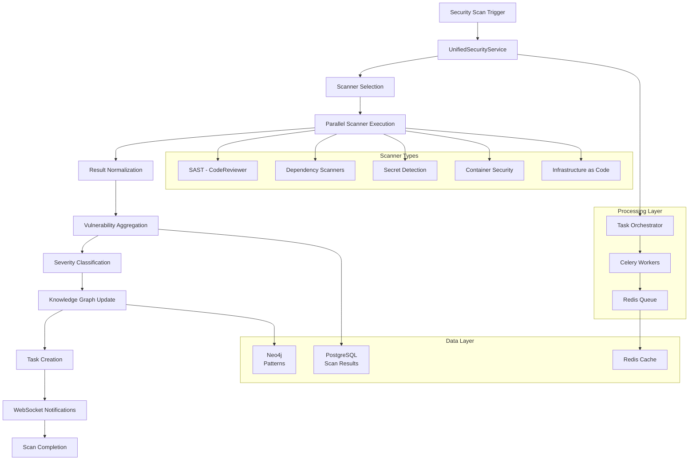
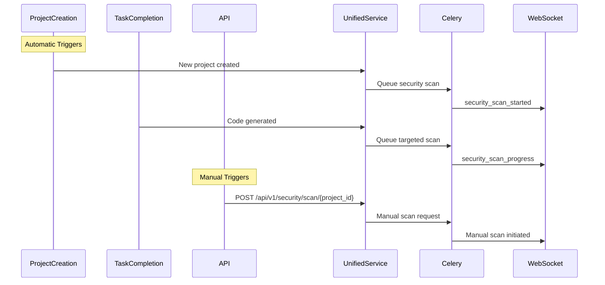
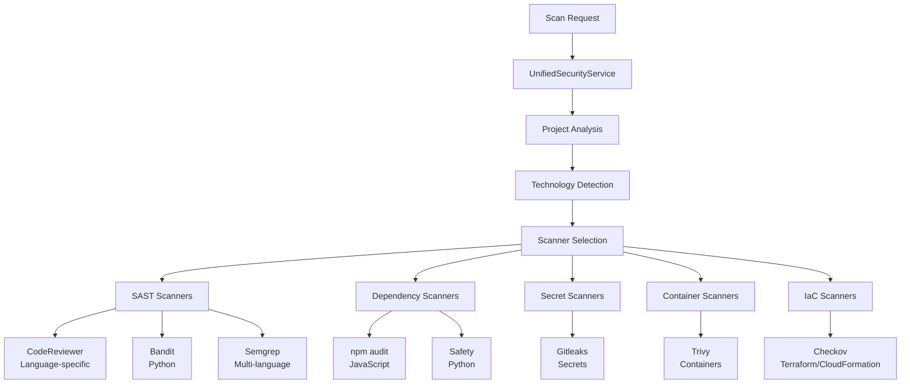
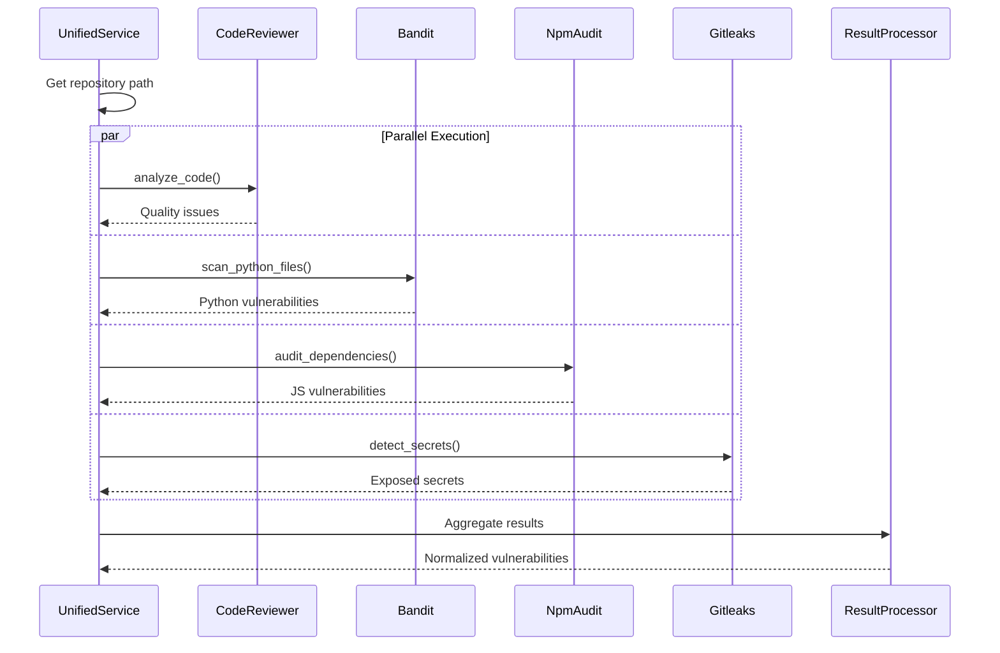
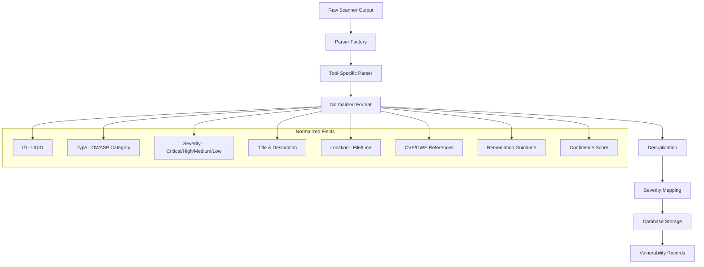
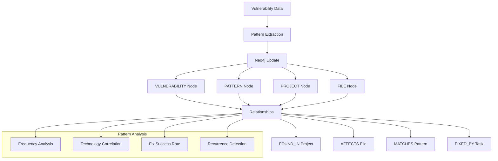
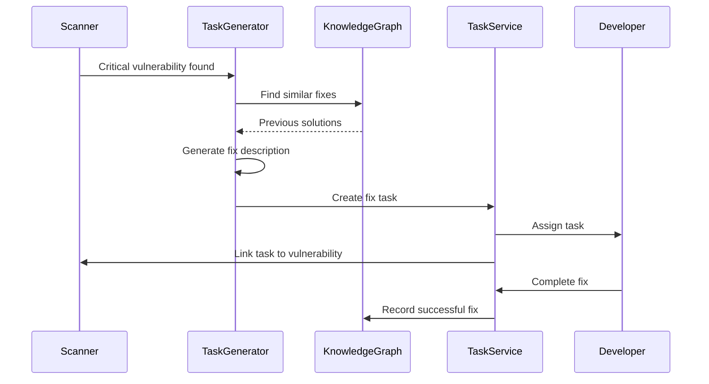
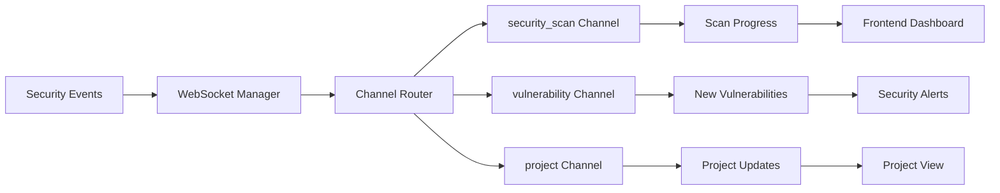
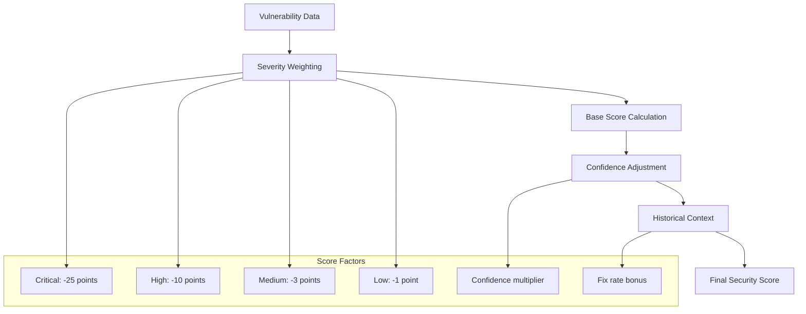

# CrewWork Security Scanning & Vulnerability Management Process

This document provides a comprehensive, phase-based analysis of CrewWork's security scanning and vulnerability management system. Built for engineers of all levels with particular focus on architectural and principal engineering concerns, this guide covers the complete workflow from automated scan initiation to vulnerability remediation through the UnifiedSecurityService.

---

## Executive Summary

CrewWork implements a sophisticated security scanning system using the **UnifiedSecurityService**, integrating multiple scanning tools (Bandit, Semgrep, npm audit, Gitleaks, etc.), **Neo4j knowledge graph for pattern learning**, and **automated task creation for remediation**. The system automatically scans projects through Celery-based distributed processing with real-time WebSocket notifications.

**Key Technologies:**
- **Backend**: UnifiedSecurityService with multi-scanner orchestration
- **Scanners**: CodeReviewer (SAST), Bandit, Semgrep, npm audit, Safety, Gitleaks, Trivy, Checkov
- **Processing**: Celery task queue with specialized validation queue
- **Storage**: PostgreSQL for scan results, Neo4j for vulnerability patterns
- **Real-time**: Enhanced WebSocket with security event channels

---

## Overview: Security Scanning Architecture



**Core Phases:**
1. **Scan Initiation** - Automatic triggers at key points
2. **Scanner Orchestration** - Dynamic tool selection based on project
3. **Parallel Execution** - Multiple scanners run concurrently
4. **Result Processing** - Normalization and deduplication
5. **Pattern Learning** - Knowledge graph updates
6. **Task Generation** - Automated remediation tasks
7. **Real-time Updates** - WebSocket progress notifications

---

## Phase 1: Scan Initiation & Trigger Points

Security scans are automatically triggered at critical points in the development lifecycle.



### Automatic Trigger Points

**Project Creation**: `/api/routers/projects.py`
```python
async def create_project(
    project_data: ProjectCreate,
    current_user: User = Depends(get_current_user),
    db: AsyncSession = Depends(get_database)
):
    # Create project
    project = await project_service.create_project(project_data, current_user.id)
    
    # Trigger initial security scan
    scan_result = await security_service.run_security_scan(
        project_id=project.id,
        scan_types=["static", "dependency", "secrets"]
    )
    
    # Broadcast scan initiation
    await websocket_manager.broadcast_to_channel(
        f"project:{project.id}",
        {
            "type": "security_scan_started",
            "scan_id": str(scan_result.id),
            "project_id": str(project.id)
        }
    )
```

**Task Completion**: `/core/services/task_orchestrator.py`
```python
async def process_task(self, task_id: UUID) -> TaskResult:
    # Generate code
    generated_files = await self._generate_code(task, context)
    
    # Run security scan on generated files
    scan_result = await self.security_service.run_targeted_scan(
        project_id=task.project_id,
        file_paths=[f['path'] for f in generated_files]
    )
    
    # Create fix tasks if issues found
    if scan_result.vulnerabilities_found > 0:
        await self._create_security_fix_tasks(scan_result)
```

### Manual API Triggers

**Security API**: `/api/routers/security.py`
```python
@router.post("/scan/{project_id}")
async def trigger_security_scan(
    project_id: UUID,
    scan_config: SecurityScanConfig,
    current_user: User = Depends(get_current_user),
    db: AsyncSession = Depends(get_database)
):
    """Manually trigger a security scan"""
    
    # Queue scan via Celery
    task = run_security_scan_task.delay(
        project_id=str(project_id),
        scan_types=scan_config.scan_types,
        user_id=str(current_user.id)
    )
    
    return {
        "task_id": task.id,
        "status": "queued",
        "scan_types": scan_config.scan_types
    }
```

---

## Phase 2: UnifiedSecurityService Orchestration

The UnifiedSecurityService coordinates multiple security scanners based on project characteristics.



### UnifiedSecurityService Implementation

**Service**: `/core/services/unified_security_service.py`

```python
class UnifiedSecurityService(BaseService):
    def __init__(self, db_service=None):
        super().__init__(db_service)
        self.scanners = {
            'sast': CodeReviewer(),
            'dependency': DependencyScanner(),
            'container': ContainerScanner(),
            'secrets': SecretScanner(),
            'infrastructure': InfrastructureScanner()
        }
        self.knowledge_graph = Neo4jKnowledgeGraphService()
    
    async def run_security_scan(
        self,
        project_id: UUID,
        scan_types: list[str] = None
    ) -> SecurityScanResult:
        """Run comprehensive security scan"""
        
        # Default to all scan types
        if not scan_types:
            scan_types = ['sast', 'dependency', 'secrets']
        
        # Get project context from knowledge graph
        context = await self.knowledge_graph.get_project_context(project_id)
        
        # Select appropriate scanners
        selected_scanners = self._select_scanners(context, scan_types)
        
        # Run scanners in parallel
        scan_tasks = []
        for scanner_name, scanner in selected_scanners.items():
            task = self._run_scanner(scanner_name, scanner, project_id)
            scan_tasks.append(task)
        
        results = await asyncio.gather(*scan_tasks, return_exceptions=True)
        
        # Normalize and aggregate results
        vulnerabilities = self._normalize_results(results)
        
        # Store scan results
        scan_record = await self._store_scan_results(
            project_id, vulnerabilities
        )
        
        # Update knowledge graph
        await self._update_vulnerability_patterns(
            project_id, vulnerabilities
        )
        
        # Create fix tasks for critical issues
        if self._has_critical_issues(vulnerabilities):
            await self._create_fix_tasks(vulnerabilities)
        
        return scan_record
```

### Scanner Selection Logic

```python
def _select_scanners(
    self,
    context: ProjectContext,
    scan_types: list[str]
) -> dict[str, BaseScanner]:
    """Select scanners based on project technology"""
    
    selected = {}
    technologies = context.technologies
    
    # SAST selection
    if 'sast' in scan_types:
        selected['code_reviewer'] = self.scanners['sast']
        
        if 'python' in technologies:
            selected['bandit'] = BanditScanner()
        
        # Semgrep for multiple languages
        if any(lang in technologies for lang in ['python', 'javascript', 'typescript']):
            selected['semgrep'] = SemgrepScanner()
    
    # Dependency scanning
    if 'dependency' in scan_types:
        if 'javascript' in technologies or 'typescript' in technologies:
            selected['npm_audit'] = NpmAuditScanner()
        
        if 'python' in technologies:
            selected['safety'] = SafetyScanner()
    
    # Secret detection
    if 'secrets' in scan_types:
        selected['gitleaks'] = GitleaksScanner()
    
    # Container scanning
    if 'container' in scan_types and self._has_dockerfile(context):
        selected['trivy'] = TrivyScanner()
    
    # Infrastructure as Code
    if 'infrastructure' in scan_types and self._has_iac_files(context):
        selected['checkov'] = CheckovScanner()
    
    return selected
```

---

## Phase 3: Parallel Scanner Execution

Multiple security scanners execute concurrently for optimal performance.



### Scanner Implementations

**CodeReviewer Integration**:
```python
async def _run_code_reviewer(
    self,
    project_id: UUID,
    repo_path: str
) -> list[dict]:
    """Run CodeReviewer for static analysis"""
    
    vulnerabilities = []
    code_reviewer = CodeReviewer()
    
    # Analyze all source files
    for file_path in self._get_source_files(repo_path):
        with open(file_path, 'r') as f:
            content = f.read()
        
        # Detect language
        language = self._detect_language(file_path)
        
        # Run analysis
        result = code_reviewer.analyze_code(
            code=content,
            language=language,
            context={'file_path': str(file_path)}
        )
        
        # Convert issues to vulnerabilities
        for issue in result.get('issues', []):
            vulnerabilities.append({
                'type': 'code_quality',
                'severity': issue['severity'],
                'title': issue['message'],
                'description': issue.get('suggestion', ''),
                'file_path': str(file_path),
                'line_number': issue.get('line_number'),
                'tool': 'code_reviewer'
            })
    
    return vulnerabilities
```

**External Tool Integration**:
```python
async def _run_bandit(
    self,
    project_id: UUID,
    repo_path: str
) -> list[dict]:
    """Run Bandit for Python security issues"""
    
    try:
        # Run Bandit command
        result = subprocess.run(
            ['bandit', '-r', repo_path, '-f', 'json'],
            capture_output=True,
            text=True,
            timeout=300
        )
        
        if result.returncode == 0:
            bandit_output = json.loads(result.stdout)
            return self._parse_bandit_results(bandit_output)
        else:
            logger.error(f"Bandit failed: {result.stderr}")
            return []
            
    except Exception as e:
        logger.error(f"Error running Bandit: {e}")
        return []
```

---

## Phase 4: Result Normalization & Storage

All scanner results are normalized into a unified format for consistent processing.



### Vulnerability Normalization

```python
def _normalize_results(
    self,
    scanner_results: list[dict]
) -> list[Vulnerability]:
    """Normalize results from all scanners"""
    
    normalized = []
    seen_vulns = set()  # For deduplication
    
    for result in scanner_results:
        if isinstance(result, Exception):
            logger.error(f"Scanner failed: {result}")
            continue
        
        for vuln in result:
            # Create normalized vulnerability
            normalized_vuln = Vulnerability(
                id=str(uuid4()),
                vulnerability_id=self._generate_vuln_id(vuln),
                type=self._map_vulnerability_type(vuln),
                severity=self._normalize_severity(vuln),
                title=vuln.get('title', 'Unknown vulnerability'),
                description=vuln.get('description', ''),
                file_path=vuln.get('file_path', ''),
                line_number=vuln.get('line_number'),
                cve_id=vuln.get('cve_id'),
                cwe_id=vuln.get('cwe_id'),
                cvss_score=vuln.get('cvss_score'),
                tool=vuln.get('tool', 'unknown'),
                confidence=vuln.get('confidence', 0.8),
                recommendation=vuln.get('recommendation', ''),
                discovered_at=datetime.utcnow()
            )
            
            # Deduplicate
            vuln_hash = self._hash_vulnerability(normalized_vuln)
            if vuln_hash not in seen_vulns:
                seen_vulns.add(vuln_hash)
                normalized.append(normalized_vuln)
    
    return normalized
```

### Database Storage

**Models**: `/db/models.py`

```python
class SecurityScan(Base):
    __tablename__ = "security_scans"
    
    id = Column(UUID(as_uuid=True), primary_key=True, default=uuid4)
    project_id = Column(UUID(as_uuid=True), ForeignKey("projects.id"))
    status = Column(String, default="running")
    started_at = Column(DateTime(timezone=True), default=datetime.utcnow)
    completed_at = Column(DateTime(timezone=True))
    
    # Summary statistics
    vulnerabilities_found = Column(Integer, default=0)
    critical_count = Column(Integer, default=0)
    high_count = Column(Integer, default=0)
    medium_count = Column(Integer, default=0)
    low_count = Column(Integer, default=0)
    
    # Security score (0-100)
    security_score = Column(Float, default=100.0)
    
    # Relationships
    vulnerabilities = relationship("Vulnerability", back_populates="scan")

class Vulnerability(Base):
    __tablename__ = "vulnerabilities"
    
    id = Column(UUID(as_uuid=True), primary_key=True, default=uuid4)
    scan_id = Column(UUID(as_uuid=True), ForeignKey("security_scans.id"))
    vulnerability_id = Column(String(500), nullable=False)
    
    # Core fields
    type = Column(String)  # sql_injection, xss, etc.
    severity = Column(String)  # critical, high, medium, low
    title = Column(String)
    description = Column(Text)
    
    # Location
    file_path = Column(String)
    line_number = Column(Integer)
    
    # References
    cve_id = Column(String)
    cwe_id = Column(String)
    cvss_score = Column(Float)
    
    # Metadata
    tool = Column(String)
    confidence = Column(Float)
    recommendation = Column(Text)
    false_positive = Column(Boolean, default=False)
    
    # Timestamps
    discovered_at = Column(DateTime(timezone=True))
    resolved_at = Column(DateTime(timezone=True))
    
    # Relationships
    scan = relationship("SecurityScan", back_populates="vulnerabilities")
```

---

## Phase 5: Knowledge Graph Pattern Learning

Vulnerability patterns are stored in Neo4j for intelligent analysis and prevention.



### Knowledge Graph Integration

```python
async def _update_vulnerability_patterns(
    self,
    project_id: UUID,
    vulnerabilities: list[Vulnerability]
) -> None:
    """Update knowledge graph with vulnerability patterns"""
    
    for vuln in vulnerabilities:
        # Create vulnerability node
        vuln_node = await self.knowledge_graph.create_node(
            label='VULNERABILITY',
            properties={
                'id': str(vuln.id),
                'type': vuln.type,
                'severity': vuln.severity,
                'tool': vuln.tool,
                'cwe_id': vuln.cwe_id,
                'discovered_at': vuln.discovered_at.isoformat()
            }
        )
        
        # Link to project
        await self.knowledge_graph.create_edge(
            from_id=str(project_id),
            from_label='PROJECT',
            to_id=vuln_node['id'],
            to_label='VULNERABILITY',
            relationship_type='HAS_VULNERABILITY',
            properties={'scan_date': datetime.utcnow().isoformat()}
        )
        
        # Create or update pattern
        pattern = await self._find_or_create_pattern(vuln)
        
        # Link vulnerability to pattern
        await self.knowledge_graph.create_edge(
            from_id=vuln_node['id'],
            from_label='VULNERABILITY',
            to_id=pattern['id'],
            to_label='PATTERN',
            relationship_type='MATCHES',
            properties={'confidence': vuln.confidence}
        )
        
        # Update pattern statistics
        await self._update_pattern_statistics(pattern['id'], vuln)
```

### Pattern-Based Prevention

```python
async def _find_similar_vulnerabilities(
    self,
    project_id: UUID,
    vulnerability: Vulnerability
) -> list[dict]:
    """Find similar vulnerabilities in other projects"""
    
    query = """
    MATCH (p:PATTERN {type: $vuln_type})
    MATCH (p)<-[:MATCHES]-(v:VULNERABILITY)
    MATCH (v)<-[:HAS_VULNERABILITY]-(proj:PROJECT)
    WHERE proj.id <> $project_id
    OPTIONAL MATCH (v)-[:FIXED_BY]->(t:TASK)
    RETURN v, proj, t
    ORDER BY v.discovered_at DESC
    LIMIT 10
    """
    
    results = await self.knowledge_graph.execute_query(
        query,
        {
            'vuln_type': vulnerability.type,
            'project_id': str(project_id)
        }
    )
    
    return [
        {
            'vulnerability': r['v'],
            'project': r['proj'],
            'fix_task': r['t']
        }
        for r in results
    ]
```

---

## Phase 6: Automated Task Creation

Critical vulnerabilities automatically generate fix tasks with context.



### Fix Task Generation

```python
async def _create_fix_tasks(
    self,
    vulnerabilities: list[Vulnerability]
) -> list[Task]:
    """Create tasks to fix vulnerabilities"""
    
    tasks = []
    
    # Group vulnerabilities by type and file
    grouped = self._group_vulnerabilities(vulnerabilities)
    
    for group_key, group_vulns in grouped.items():
        # Only create tasks for high/critical
        high_severity = [
            v for v in group_vulns 
            if v.severity in ['critical', 'high']
        ]
        
        if not high_severity:
            continue
        
        # Find similar fixes
        similar_fixes = await self._find_similar_fixes(
            high_severity[0]
        )
        
        # Generate task
        task = await self.task_service.create_task(
            title=f"Fix {high_severity[0].type} vulnerability",
            description=self._generate_fix_description(
                vulnerabilities=high_severity,
                similar_fixes=similar_fixes
            ),
            project_id=high_severity[0].project_id,
            priority='high' if 'critical' in [v.severity for v in high_severity] else 'medium',
            tags=['security', 'vulnerability', high_severity[0].type],
            metadata={
                'vulnerability_ids': [str(v.id) for v in high_severity],
                'scan_id': str(high_severity[0].scan_id),
                'auto_generated': True,
                'suggested_fixes': similar_fixes
            }
        )
        
        tasks.append(task)
        
        # Link task to vulnerabilities
        for vuln in high_severity:
            await self._link_task_to_vulnerability(task.id, vuln.id)
    
    return tasks
```

### Fix Description Generation

```python
def _generate_fix_description(
    self,
    vulnerabilities: list[Vulnerability],
    similar_fixes: list[dict]
) -> str:
    """Generate detailed fix description"""
    
    vuln = vulnerabilities[0]  # Primary vulnerability
    
    description = f"""
## Security Vulnerability: {vuln.title}

**Severity**: {vuln.severity.upper()}
**Type**: {vuln.type}
**File**: {vuln.file_path}
{f'**Line**: {vuln.line_number}' if vuln.line_number else ''}

### Description
{vuln.description}

### Recommendation
{vuln.recommendation}

### Similar Issues Fixed Previously
"""
    
    if similar_fixes:
        for fix in similar_fixes[:3]:
            description += f"""
- **Project**: {fix['project_name']}
  **Fix Applied**: {fix['fix_description']}
  **Success**: {fix['success_rate']}%
"""
    else:
        description += "\nNo similar fixes found in other projects.\n"
    
    if vuln.cwe_id:
        description += f"\n### References\n- CWE-{vuln.cwe_id}: https://cwe.mitre.org/data/definitions/{vuln.cwe_id}.html"
    
    return description
```

---

## Phase 7: Real-time Notifications

WebSocket notifications keep developers informed throughout the scan.



### WebSocket Events

**Celery Task**: `/core/tasks/security_tasks.py`

```python
@celery_app.task(bind=True, name='security.scan')
def run_security_scan_task(self, project_id: str):
    """Run security scan as Celery task"""
    
    async def scan():
        # Initialize services
        security_service = UnifiedSecurityService()
        websocket_manager = get_websocket_manager()
        
        try:
            # Start notification
            await websocket_manager.broadcast_to_channel(
                'security_scan',
                {
                    'type': 'scan_started',
                    'project_id': project_id,
                    'timestamp': datetime.utcnow().isoformat()
                }
            )
            
            # Progress updates
            for progress in range(0, 100, 10):
                await websocket_manager.broadcast_to_channel(
                    f'project:{project_id}',
                    {
                        'type': 'scan_progress',
                        'progress': progress,
                        'message': f'Scanning... {progress}%'
                    }
                )
                
                # Update Celery task state
                self.update_state(
                    state='PROGRESS',
                    meta={'current': progress, 'total': 100}
                )
            
            # Run scan
            result = await security_service.run_security_scan(
                UUID(project_id)
            )
            
            # Completion notification
            await websocket_manager.broadcast_to_channel(
                'security_scan',
                {
                    'type': 'scan_completed',
                    'project_id': project_id,
                    'scan_id': str(result.id),
                    'vulnerabilities_found': result.vulnerabilities_found,
                    'security_score': result.security_score,
                    'critical_count': result.critical_count,
                    'high_count': result.high_count
                }
            )
            
            # Alert for critical vulnerabilities
            if result.critical_count > 0:
                await websocket_manager.broadcast_to_channel(
                    'vulnerability',
                    {
                        'type': 'critical_vulnerability_alert',
                        'project_id': project_id,
                        'count': result.critical_count,
                        'message': f'{result.critical_count} critical vulnerabilities found!'
                    }
                )
            
        except Exception as e:
            await websocket_manager.broadcast_to_channel(
                'security_scan',
                {
                    'type': 'scan_failed',
                    'project_id': project_id,
                    'error': str(e)
                }
            )
            raise
    
    # Run async function
    asyncio.run(scan())
```

### Frontend Integration

**React Hook**: `/frontend/src/hooks/useSecurityScan.ts`

```typescript
export function useSecurityScan(projectId: string) {
  const { subscribe } = useWebSocketSubscription();
  const [scanStatus, setScanStatus] = useState<ScanStatus>('idle');
  const [progress, setProgress] = useState(0);
  const [results, setResults] = useState<SecurityResults | null>(null);
  
  useEffect(() => {
    // Subscribe to multiple channels
    const channels = [
      'security_scan',
      `project:${projectId}`,
      'vulnerability'
    ];
    
    const unsubscribe = subscribe(channels, (event) => {
      switch (event.type) {
        case 'scan_started':
          if (event.project_id === projectId) {
            setScanStatus('scanning');
            setProgress(0);
          }
          break;
          
        case 'scan_progress':
          setProgress(event.progress);
          break;
          
        case 'scan_completed':
          if (event.project_id === projectId) {
            setScanStatus('completed');
            setProgress(100);
            setResults({
              scanId: event.scan_id,
              vulnerabilitiesFound: event.vulnerabilities_found,
              securityScore: event.security_score,
              criticalCount: event.critical_count,
              highCount: event.high_count
            });
          }
          break;
          
        case 'critical_vulnerability_alert':
          if (event.project_id === projectId) {
            // Show alert notification
            showAlert({
              type: 'error',
              message: event.message
            });
          }
          break;
      }
    });
    
    return unsubscribe;
  }, [projectId, subscribe]);
  
  return { scanStatus, progress, results };
}
```

---

## Security Metrics & Scoring

CrewWork calculates a comprehensive security score based on vulnerability findings.



### Score Calculation

```python
def calculate_security_score(
    self,
    vulnerabilities: list[Vulnerability]
) -> float:
    """Calculate security score (0-100)"""
    
    if not vulnerabilities:
        return 100.0
    
    # Base weights
    severity_weights = {
        'critical': 25,
        'high': 10,
        'medium': 3,
        'low': 1
    }
    
    # Calculate penalty
    total_penalty = 0
    for vuln in vulnerabilities:
        if vuln.false_positive:
            continue
            
        weight = severity_weights.get(vuln.severity, 1)
        # Apply confidence factor
        penalty = weight * vuln.confidence
        total_penalty += penalty
    
    # Cap maximum penalty
    total_penalty = min(total_penalty, 100)
    
    # Calculate score
    score = max(0, 100 - total_penalty)
    
    return round(score, 1)
```

---

## Performance Optimizations

### Parallel Processing
- Scanner execution uses asyncio.gather for concurrency
- Celery workers handle multiple scans simultaneously
- Results processing is batched for efficiency

### Caching Strategy
- Scanner availability cached in Redis (1 hour TTL)
- Vulnerability patterns cached for quick lookup
- Previous scan results cached for comparison

### Resource Management
- Large repositories scanned in chunks
- Memory-efficient file processing
- Timeout limits on external tools

---

## Security Considerations

### Scanner Isolation
- External tools run in sandboxed environments
- Limited network access for scanners
- Resource quotas enforced

### Result Validation
- Scanner output sanitized before storage
- Injection prevention in all parsers
- Signature verification for tool binaries

### Access Control
- Project-based permissions for scan results
- Sensitive findings redacted in logs
- Audit trail for all security operations

---

## Current Implementation Status

### ✅ Fully Implemented
- UnifiedSecurityService orchestration
- CodeReviewer integration
- Multi-scanner parallel execution
- Result normalization and storage
- Knowledge graph pattern learning
- Automated task creation
- WebSocket notifications
- Security scoring

### 🚧 In Progress
- Additional scanner integrations
- Machine learning for false positive detection
- Compliance framework mapping
- Vulnerability trend analysis

### 📋 Planned
- Container registry scanning
- Runtime security monitoring
- Supply chain analysis
- Threat intelligence integration

---

## Summary

CrewWork's security scanning process provides comprehensive vulnerability detection through:
- **Unified orchestration** of multiple security tools
- **Intelligent scanner selection** based on project technology
- **Pattern learning** through knowledge graph integration
- **Automated remediation** via task generation
- **Real-time visibility** with WebSocket notifications

The system ensures security is built into the development process, not bolted on afterwards.